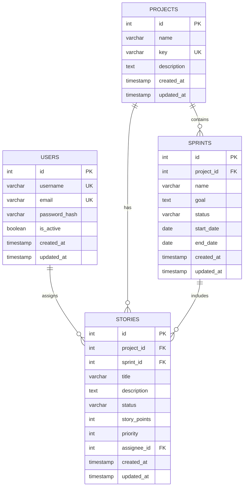

# データベース設計書

## 1. ER 図



## 1. テーブル一覧

| テーブル名 | 説明             | 補足                   |
| ---------- | ---------------- | ---------------------- |
| users      | ユーザー情報     | 認証・認可情報を含む   |
| projects   | プロジェクト情報 | -                      |
| sprints    | スプリント情報   | プロジェクトの期間管理 |
| stories    | ストーリー情報   | タスク・課題管理       |

## 2. テーブル定義

### 2.1 users

| カラム        | データ型     | NULL | キー | 初期値 | 説明               |
| ------------- | ------------ | ---- | ---- | ------ | ------------------ |
| id            | INTEGER      | NO   | PK   | -      | ユーザー ID        |
| username      | VARCHAR(50)  | NO   | UQ   | -      | ユーザー名         |
| email         | VARCHAR(120) | NO   | UQ   | -      | メールアドレス     |
| password_hash | VARCHAR(128) | NO   | -    | -      | パスワードハッシュ |
| is_active     | BOOLEAN      | NO   | -    | TRUE   | アクティブフラグ   |
| created_at    | TIMESTAMP    | NO   | -    | NOW()  | 作成日時           |
| updated_at    | TIMESTAMP    | NO   | -    | NOW()  | 更新日時           |

### 2.2 projects

| カラム      | データ型     | NULL | キー | 初期値 | 説明             |
| ----------- | ------------ | ---- | ---- | ------ | ---------------- |
| id          | INTEGER      | NO   | PK   | -      | プロジェクト ID  |
| name        | VARCHAR(100) | NO   | -    | -      | プロジェクト名   |
| key         | VARCHAR(10)  | NO   | UQ   | -      | プロジェクトキー |
| description | TEXT         | YES  | -    | NULL   | 説明             |
| created_at  | TIMESTAMP    | NO   | -    | NOW()  | 作成日時         |
| updated_at  | TIMESTAMP    | NO   | -    | NOW()  | 更新日時         |

### 2.3 sprints

| カラム     | データ型    | NULL | キー | 初期値   | 説明            |
| ---------- | ----------- | ---- | ---- | -------- | --------------- |
| id         | INTEGER     | NO   | PK   | -        | スプリント ID   |
| project_id | INTEGER     | NO   | FK   | -        | プロジェクト ID |
| name       | VARCHAR(50) | NO   | -    | -        | スプリント名    |
| goal       | TEXT        | YES  | -    | NULL     | スプリント目標  |
| status     | VARCHAR(20) | NO   | -    | planning | 状態            |
| start_date | DATE        | YES  | -    | NULL     | 開始日          |
| end_date   | DATE        | YES  | -    | NULL     | 終了日          |
| created_at | TIMESTAMP   | NO   | -    | NOW()    | 作成日時        |
| updated_at | TIMESTAMP   | NO   | -    | NOW()    | 更新日時        |

### 2.4 stories

| カラム       | データ型     | NULL | キー | 初期値 | 説明            |
| ------------ | ------------ | ---- | ---- | ------ | --------------- |
| id           | INTEGER      | NO   | PK   | -      | ストーリー ID   |
| project_id   | INTEGER      | NO   | FK   | -      | プロジェクト ID |
| sprint_id    | INTEGER      | YES  | FK   | NULL   | スプリント ID   |
| title        | VARCHAR(200) | NO   | -    | -      | タイトル        |
| description  | TEXT         | YES  | -    | NULL   | 説明            |
| status       | VARCHAR(20)  | NO   | -    | todo   | 状態            |
| story_points | INTEGER      | YES  | -    | NULL   | ポイント        |
| priority     | INTEGER      | NO   | -    | 0      | 優先度          |
| assignee_id  | INTEGER      | YES  | FK   | NULL   | 担当者 ID       |
| created_at   | TIMESTAMP    | NO   | -    | NOW()  | 作成日時        |
| updated_at   | TIMESTAMP    | NO   | -    | NOW()  | 更新日時        |

## 3. ステータス定義

### 3.1 Sprint.status

| 値        | 説明     | 遷移可能な値 |
| --------- | -------- | ------------ |
| planning  | ��� 画中 | active       |
| active    | 実行中   | completed    |
| completed | 完了     | -            |

### 3.2 Story.status

| 値    | 説明   | 表示色               |
| ----- | ------ | -------------------- |
| todo  | 未着手 | 緑 (#E3FCEF/#006644) |
| doing | 進行中 | 赤 (#FFEBE6/#BF2600) |
| done  | 完了   | 灰 (#EBECF0/#42526E) |

### 3.3 Story.priority

| 値  | 説明 | 表示色  | アイコン |
| --- | ---- | ------- | -------- |
| 0   | なし | #6B778C | -        |
| 1   | 低   | #2D8738 | ↓        |
| 2   | 中   | #0052CC | =        |
| 3   | 高   | #CD5A19 | ↑        |
| 4   | 最高 | #CD1F1F | ↑↑       |

## 4. インデックス

### 4.1 stories

| インデックス名      | カラム                        | 説明                       |
| ------------------- | ----------------------------- | -------------------------- |
| idx_stories_sprint  | sprint_id, status, priority   | かんばんボード表示の高速化 |
| idx_stories_project | project_id, sprint_id, status | バックログ表示の高速化     |

### 4.2 sprints

| インデックス名      | カラム               | 説明                         |
| ------------------- | -------------------- | ---------------------------- |
| idx_sprints_project | project_id, status   | アクティブスプリントの �� 索 |
| idx_sprints_dates   | start_date, end_date | 期間による検索               |

## 5. 制約条件

### stories

- status: 'todo', 'in_progress', 'done'のいずれか
- points: 0 以上の整数
- priority: 'high', 'medium', 'low'のいずれか

### sprints

- status: 'planning', 'active', 'completed'のいずれか
- end_date > start_date

## 6. トリガー

### updated_at 自動更新

```sql
CREATE TRIGGER update_users_timestamp
    AFTER UPDATE ON users
BEGIN
    UPDATE users SET updated_at = CURRENT_TIMESTAMP
    WHERE id = NEW.id;
END;

CREATE TRIGGER update_projects_timestamp
    AFTER UPDATE ON projects
BEGIN
    UPDATE projects SET updated_at = CURRENT_TIMESTAMP
    WHERE id = NEW.id;
END;

CREATE TRIGGER update_stories_timestamp
    AFTER UPDATE ON stories
BEGIN
    UPDATE stories SET updated_at = CURRENT_TIMESTAMP
    WHERE id = NEW.id;
END;
```

## 7. バックアップ方法

### SQLite データベースのバックアップ

```bash
# バックアップの作成
sqlite3 database.db ".backup 'backup.db'"

# バックアップからの復元
sqlite3 database.db ".restore 'backup.db'"
```

## 8. データ型の説明

- INTEGER: 整数値
- TEXT: UTF-8 テキスト
- TIMESTAMP: 'YYYY-MM-DD HH:MM:SS'形式
- DATE: 'YYYY-MM-DD'形式
- BOOLEAN: 0 または 1
