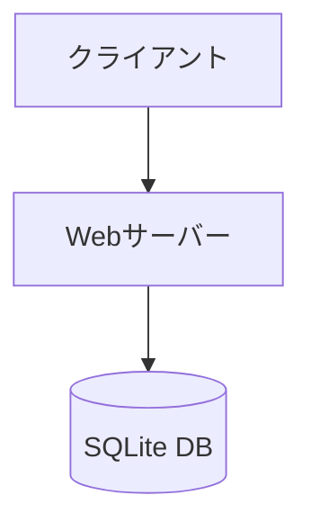
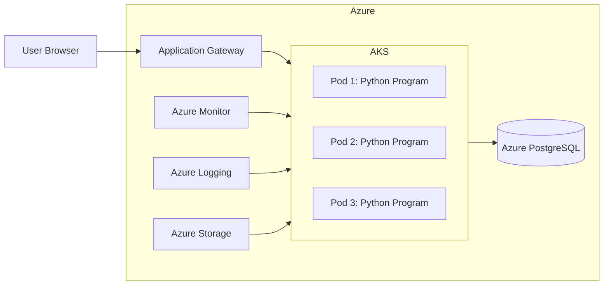
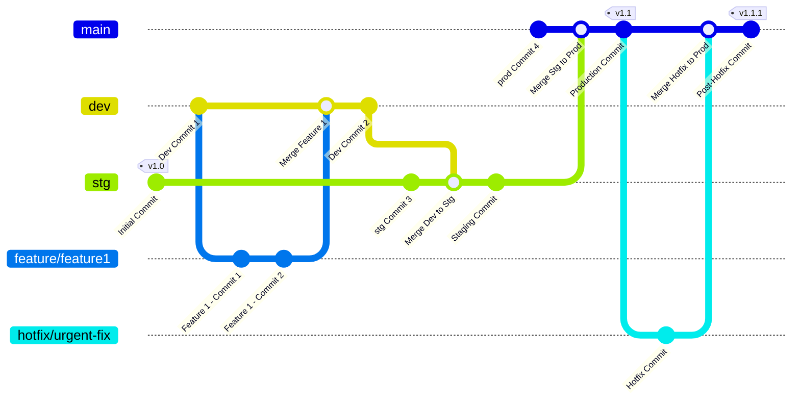

# インフラ構成設計書

## 1. システム構成図

## 1.2 生産環境システム構成図

## 2. 環境構成

### 開発環境

- ローカル開発環境
  - Python 3.x
  - Flask 開発サーバー
  - SQLite データベース

### テスト環境

- CI/CD 環境（GitHub Actions）
- テスト用データベース
- 自動テスト実行環境

### 本番環境

- Web サーバー: Nginx + gunicorn
- データベース: SQLite
- バックアップシステム

## 3. サーバー構成

### Web サーバー

- Nginx + gunicorn
- スペック
  - CPU: 2 vCPU
  - メモリ: 4 GB
  - ディスク: 50 GB SSD

### データベース

- SQLite
- ファイルベース
- 定期バックアップ

## 4. セキュリティ設定

### Web サーバー設定

- HTTPS/SSL 対応
- セキュリティヘッダーの設定
- アクセス制限

### アプリケーションセキュリティ

- CSRF 対策
- XSS 対策
- SQL インジェクション対策
- セッション管理

## 5. バックアップ設計

### データベースバックアップ

- 日次フルバックアップ
- バックアップファイルの暗号化
- 30 日間保持

### ログバックアップ

- アプリケーションログ: 90 日保持
- アクセスログ: 90 日保持
- エラーログ: 90 日保持

## 6. 監視設計

### 監視項目

- サーバーリソース（CPU、メモリ、ディスク）
- アプリケーション状態
- エラーログ
- アクセスログ

### アラート設定

- サーバーダウン検知
- エラー率の閾値超過
- ディスク使用率の警告

## 7. デプロイメントフロー

### デプロイ手順

1. ソースコードのプッシュ
2. 自動テストの実行
3. テスト環境へのデプロイ
4. 動作確認
5. 本番環境へのデプロイ

## 8. 開発環境セットアップ

### 必要なソフトウェア

- Python 3.x
- pip
- Git
- Visual Studio Code（推奨）

### ローカル環境構築手順

1. リポジトリのクローン
2. 仮想環境の作成
3. 依存パッケージのインストール
4. データベースの初期化
5. 開発サーバーの起動

## 9. Git 使用ルール

- ブランチ構成
  - `dev`: 開発環境用
  - `stg`: ステージング環境用
  - `main`: 本番環境用
  - `feature`: 新機能開発用
  - `hotfix`: 緊急バグ修正用
- マージはすべてプルリクエストを通じて行う

## 10. Azure DevOps パイプライン

- `dev`環境は毎日 Azure にデプロイ
- `stg`と`prod`環境はマージに基づいて自動 CD

## 11. Docker と Kubernetes のセットアップ

### Dockerfile

Dockerfile は、Python アプリケーションの Docker イメージをビルドするために使用されます。以下の手順が含まれています：

1. Docker Hub から公式の Python イメージを使用します。
2. 作業ディレクトリを`/app`に設定します。
3. アプリケーションコードをコンテナにコピーします。
4. `requirements.txt`から依存関係をインストールします。
5. アプリケーションのためにポート 8888 を公開します。
6. `python app.py`を使用してアプリケーションを実行します。

### Kubernetes マニフェスト

#### デプロイメント

`deployment.yaml`ファイルは、Azure Kubernetes Service (AKS)上でのアプリケーションのデプロイメントを定義します。以下の仕様が含まれています：

- **レプリカ数**: 3
- **コンテナイメージ**: `<your-docker-image>`を実際のイメージ名に置き換えてください。
- **コンテナポート**: 8888

#### サービス

`service.yaml`ファイルは、LoadBalancer サービスを使用してアプリケーションを公開します。以下の仕様が含まれています：

- **サービスタイプ**: LoadBalancer
- **ポート**: 80
- **ターゲットポート**: 8888

### デプロイメント手順

1. Dockerfile を使用して Docker イメージをビルドします。
2. Docker イメージをコンテナレジストリにプッシュします。
3. Kubernetes マニフェストを適用して、AKS にアプリケーションをデプロイします。
