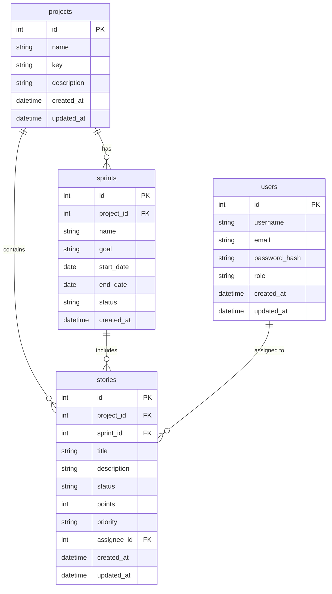

# データベース設計書

## 1. ER 図



## 2. テーブル構成

### users（ユーザー）テーブル

```sql
CREATE TABLE users (
    id INTEGER PRIMARY KEY AUTOINCREMENT,
    username TEXT NOT NULL UNIQUE,
    email TEXT NOT NULL UNIQUE,
    password_hash TEXT NOT NULL,
    role TEXT NOT NULL DEFAULT 'user',
    created_at TIMESTAMP NOT NULL DEFAULT CURRENT_TIMESTAMP,
    updated_at TIMESTAMP NOT NULL DEFAULT CURRENT_TIMESTAMP
);
```

### projects（プロジェクト）テーブル

```sql
CREATE TABLE projects (
    id INTEGER PRIMARY KEY AUTOINCREMENT,
    name TEXT NOT NULL,
    key TEXT NOT NULL UNIQUE,
    description TEXT,
    created_at TIMESTAMP NOT NULL DEFAULT CURRENT_TIMESTAMP,
    updated_at TIMESTAMP NOT NULL DEFAULT CURRENT_TIMESTAMP
);
```

### sprints（スプリント）テーブル

```sql
CREATE TABLE sprints (
    id INTEGER PRIMARY KEY AUTOINCREMENT,
    project_id INTEGER NOT NULL,
    name TEXT NOT NULL,
    goal TEXT,
    start_date DATE,
    end_date DATE,
    status TEXT NOT NULL DEFAULT 'planning',
    created_at TIMESTAMP NOT NULL DEFAULT CURRENT_TIMESTAMP,
    FOREIGN KEY (project_id) REFERENCES projects (id)
);
```

### stories（ストーリー）テーブル

```sql
CREATE TABLE stories (
    id INTEGER PRIMARY KEY AUTOINCREMENT,
    project_id INTEGER NOT NULL,
    sprint_id INTEGER,
    title TEXT NOT NULL,
    description TEXT,
    status TEXT NOT NULL DEFAULT 'todo',
    points INTEGER,
    priority TEXT NOT NULL DEFAULT 'medium',
    assignee_id INTEGER,
    created_at TIMESTAMP NOT NULL DEFAULT CURRENT_TIMESTAMP,
    updated_at TIMESTAMP NOT NULL DEFAULT CURRENT_TIMESTAMP,
    FOREIGN KEY (project_id) REFERENCES projects (id),
    FOREIGN KEY (sprint_id) REFERENCES sprints (id),
    FOREIGN KEY (assignee_id) REFERENCES users (id)
);
```

## 3. テーブル関連

1. プロジェクトとスプリント

   - 1 つのプロジェクトは複数のスプリントを持つ（1:N）
   - スプリントは必ず 1 つのプロジェクトに属する

2. プロジェクトとストーリー

   - 1 つのプロジェクトは複数のストーリーを持つ（1:N）
   - ストーリーは必ず 1 つのプロジェクトに属する

3. スプリントとストーリー

   - 1 つのスプリントは複数のストーリーを持つ（1:N）
   - ストーリーは 0 または 1 つのスプリントに属する

4. ユーザーとストーリー
   - 1 人のユーザーは複数のストーリーを担当できる（1:N）
   - ストーリーは 0 または 1 人のユーザーに割り当てられる

## 4. インデックス設定

### users

```sql
CREATE UNIQUE INDEX idx_users_username ON users(username);
CREATE UNIQUE INDEX idx_users_email ON users(email);
```

### projects

```sql
CREATE UNIQUE INDEX idx_projects_key ON projects(key);
```

### stories

```sql
CREATE INDEX idx_stories_project_sprint ON stories(project_id, sprint_id);
CREATE INDEX idx_stories_assignee ON stories(assignee_id);
CREATE INDEX idx_stories_status ON stories(status);
```

### sprints

```sql
CREATE INDEX idx_sprints_project ON sprints(project_id);
CREATE INDEX idx_sprints_status ON sprints(status);
```

## 5. 制約条件

### stories

- status: 'todo', 'in_progress', 'done'のいずれか
- points: 0 以上の整数
- priority: 'high', 'medium', 'low'のいずれか

### sprints

- status: 'planning', 'active', 'completed'のいずれか
- end_date > start_date

## 6. トリガー

### updated_at 自動更新

```sql
CREATE TRIGGER update_users_timestamp
    AFTER UPDATE ON users
BEGIN
    UPDATE users SET updated_at = CURRENT_TIMESTAMP
    WHERE id = NEW.id;
END;

CREATE TRIGGER update_projects_timestamp
    AFTER UPDATE ON projects
BEGIN
    UPDATE projects SET updated_at = CURRENT_TIMESTAMP
    WHERE id = NEW.id;
END;

CREATE TRIGGER update_stories_timestamp
    AFTER UPDATE ON stories
BEGIN
    UPDATE stories SET updated_at = CURRENT_TIMESTAMP
    WHERE id = NEW.id;
END;
```

## 7. バックアップ方法

### SQLite データベースのバックアップ

```bash
# バックアップの作成
sqlite3 database.db ".backup 'backup.db'"

# バックアップからの復元
sqlite3 database.db ".restore 'backup.db'"
```

## 8. データ型の説明

- INTEGER: 整数値
- TEXT: UTF-8 テキスト
- TIMESTAMP: 'YYYY-MM-DD HH:MM:SS'形式
- DATE: 'YYYY-MM-DD'形式
- BOOLEAN: 0 または 1
