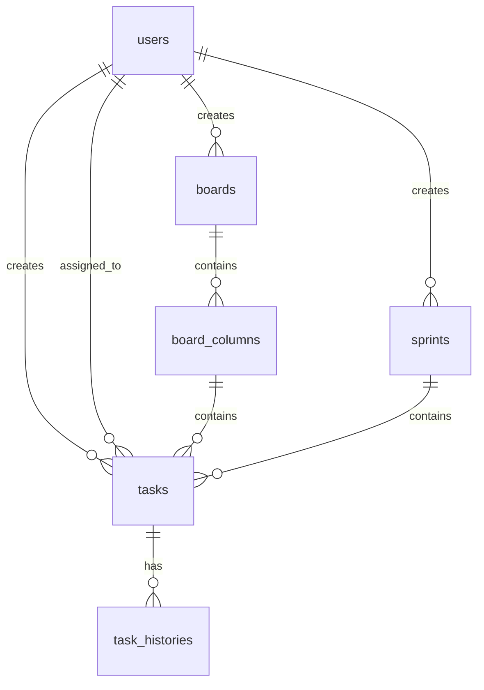

# GIRA项目数据库设计文档

## 1. 数据库概述
本系统采用关系型数据库，使用MySQL 8.0版本。所有表格采用InnoDB引擎，字符集使用utf8mb4。

## 2. 表结构设计

### 2.1 用户表（users）
| 字段名 | 类型 | 长度 | 允许空 | 默认值 | 说明 |
|--------|------|------|--------|--------|------|
| id | bigint | - | 否 | - | 主键，自增 |
| username | varchar | 50 | 否 | - | 用户名，唯一 |
| password | varchar | 255 | 否 | - | 密码（加密存储）|
| email | varchar | 100 | 否 | - | 邮箱地址 |
| full_name | varchar | 100 | 否 | - | 用户全名 |
| role | varchar | 20 | 否 | 'DEVELOPER' | 用户角色（ADMIN/DEVELOPER）|
| status | varchar | 20 | 否 | 'ACTIVE' | 用户状态 |
| created_at | datetime | - | 否 | CURRENT_TIMESTAMP | 创建时间 |
| updated_at | datetime | - | 否 | CURRENT_TIMESTAMP | 更新时间 |

索引：
- PRIMARY KEY (id)
- UNIQUE KEY idx_username (username)
- UNIQUE KEY idx_email (email)

### 2.2 看板表（boards）
| 字段名 | 类型 | 长度 | 允许空 | 默认值 | 说明 |
|--------|------|------|--------|--------|------|
| id | bigint | - | 否 | - | 主键，自增 |
| name | varchar | 100 | 否 | - | 看板名称 |
| description | text | - | 是 | NULL | 看板描述 |
| created_by | bigint | - | 否 | - | 创建者ID |
| created_at | datetime | - | 否 | CURRENT_TIMESTAMP | 创建时间 |
| updated_at | datetime | - | 否 | CURRENT_TIMESTAMP | 更新时间 |

索引：
- PRIMARY KEY (id)
- KEY idx_created_by (created_by)

### 2.3 看板列表（board_columns）
| 字段名 | 类型 | 长度 | 允许空 | 默认值 | 说明 |
|--------|------|------|--------|--------|------|
| id | bigint | - | 否 | - | 主键，自增 |
| board_id | bigint | - | 否 | - | 所属看板ID |
| name | varchar | 50 | 否 | - | 列名称 |
| order_index | int | - | 否 | 0 | 列顺序 |
| wip_limit | int | - | 是 | NULL | 在制品数量限制 |
| created_at | datetime | - | 否 | CURRENT_TIMESTAMP | 创建时间 |
| updated_at | datetime | - | 否 | CURRENT_TIMESTAMP | 更新时间 |

索引：
- PRIMARY KEY (id)
- KEY idx_board_id (board_id)

### 2.4 Sprint表（sprints）
| 字段名 | 类型 | 长度 | 允许空 | 默认值 | 说明 |
|--------|------|------|--------|--------|------|
| id | bigint | - | 否 | - | 主键，自增 |
| name | varchar | 100 | 否 | - | Sprint名称 |
| start_date | date | - | 是 | NULL | 开始日期 |
| end_date | date | - | 是 | NULL | 结束日期 |
| status | varchar | 20 | 否 | 'PLANNING' | Sprint状态 |
| created_by | bigint | - | 否 | - | 创建者ID |
| created_at | datetime | - | 否 | CURRENT_TIMESTAMP | 创建时间 |
| updated_at | datetime | - | 否 | CURRENT_TIMESTAMP | 更新时间 |

索引：
- PRIMARY KEY (id)
- KEY idx_created_by (created_by)

### 2.5 任务表（tasks）
| 字段名 | 类型 | 长度 | 允许空 | 默认值 | 说明 |
|--------|------|------|--------|--------|------|
| id | bigint | - | 否 | - | 主键，自增 |
| title | varchar | 200 | 否 | - | 任务标题 |
| description | text | - | 是 | NULL | 任务描述 |
| sprint_id | bigint | - | 是 | NULL | 所属SprintID |
| column_id | bigint | - | 否 | - | 所属列ID |
| assignee_id | bigint | - | 是 | NULL | 经办人ID |
| reporter_id | bigint | - | 否 | - | 报告人ID |
| priority | varchar | 20 | 否 | 'MEDIUM' | 优先级 |
| status | varchar | 20 | 否 | 'TODO' | 任务状态 |
| created_at | datetime | - | 否 | CURRENT_TIMESTAMP | 创建时间 |
| updated_at | datetime | - | 否 | CURRENT_TIMESTAMP | 更新时间 |

索引：
- PRIMARY KEY (id)
- KEY idx_sprint_id (sprint_id)
- KEY idx_column_id (column_id)
- KEY idx_assignee_id (assignee_id)
- KEY idx_reporter_id (reporter_id)

### 2.6 任务历史表（task_histories）
| 字段名 | 类型 | 长度 | 允许空 | 默认值 | 说明 |
|--------|------|------|--------|--------|------|
| id | bigint | - | 否 | - | 主键，自增 |
| task_id | bigint | - | 否 | - | 任务ID |
| field | varchar | 50 | 否 | - | 变更字段 |
| old_value | text | - | 是 | NULL | 原值 |
| new_value | text | - | 是 | NULL | 新值 |
| changed_by | bigint | - | 否 | - | 变更人ID |
| created_at | datetime | - | 否 | CURRENT_TIMESTAMP | 创建时间 |

索引：
- PRIMARY KEY (id)
- KEY idx_task_id (task_id)
- KEY idx_changed_by (changed_by)

## 3. 表关系图


## 4. 初始数据
系统初始化时需要插入以下基础数据：

### 4.1 管理员用户
```sql
INSERT INTO users (username, password, email, full_name, role, status)
VALUES ('admin', '{bcrypt}$2a$10$...', 'admin@example.com', 'System Admin', 'ADMIN', 'ACTIVE');
```

### 4.2 默认看板列
```sql
INSERT INTO board_columns (board_id, name, order_index)
VALUES 
(1, 'To Do', 0),
(1, 'In Progress', 1),
(1, 'Done', 2);
```

## 5. 数据库维护建议

### 5.1 备份策略
- 每日凌晨进行全量备份
- 每小时进行增量备份
- 保留最近30天的备份数据

### 5.2 性能优化
- 所有表使用InnoDB引擎
- 根据查询模式创建合适的索引
- 定期进行ANALYZE TABLE操作
- 监控慢查询日志并优化

### 5.3 安全建议
- 使用强密码策略
- 定期轮换数据库密码
- 限制数据库远程访问
- 对敏感数据进行加密存储 