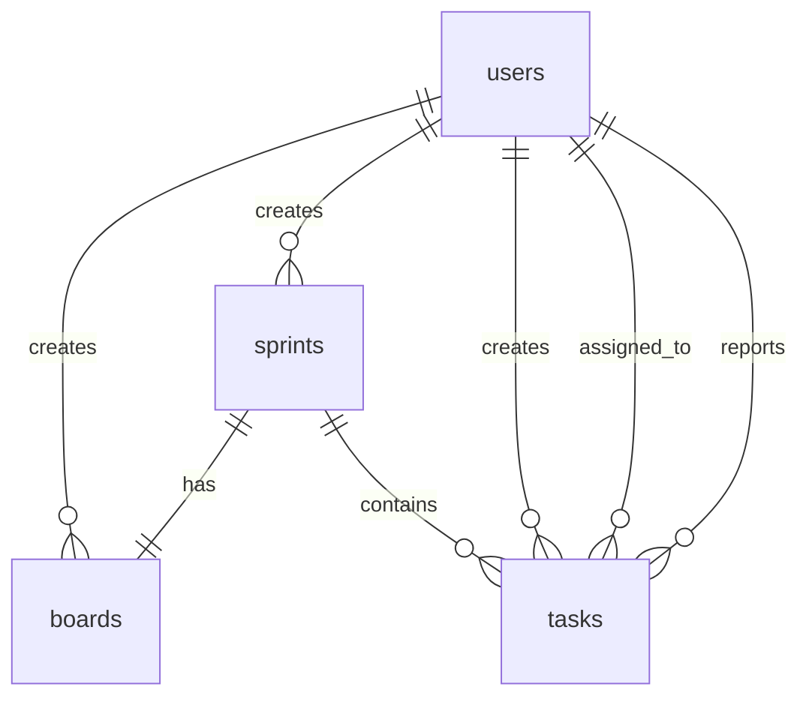

# GIRA项目数据库设计文档

## 1. 数据库概述
本系统采用关系型数据库PostgreSQL 14。所有表格采用UTF-8字符集。

## 2. 表结构设计

### 2.1 用户表（users）
| 字段名 | 类型 | 长度 | 允许空 | 默认值 | 说明 |
|--------|------|------|--------|--------|------|
| id | bigint | - | 否 | - | 主键，自增 |
| username | varchar | 50 | 否 | - | 用户名，唯一 |
| password | varchar | 100 | 否 | - | 密码（加密存储）|
| email | varchar | 100 | 否 | - | 邮箱地址 |
| full_name | varchar | 100 | 否 | - | 用户全名 |
| role | varchar | 20 | 否 | 'DEVELOPER' | 用户角色（ADMIN/DEVELOPER）|
| status | varchar | 20 | 否 | 'ACTIVE' | 用户状态（ACTIVE/INACTIVE）|
| created_at | timestamp | - | 否 | CURRENT_TIMESTAMP | 创建时间 |
| updated_at | timestamp | - | 否 | CURRENT_TIMESTAMP | 更新时间 |

索引：
- PRIMARY KEY (id)
- UNIQUE KEY idx_username (username)
- UNIQUE KEY idx_email (email)

### 2.2 看板表（boards）
| 字段名 | 类型 | 长度 | 允许空 | 默认值 | 说明 |
|--------|------|------|--------|--------|------|
| id | bigint | - | 否 | - | 主键，自增 |
| name | varchar | 100 | 否 | - | 看板名称 |
| description | text | - | 是 | NULL | 看板描述 |
| status | varchar | 20 | 否 | 'ACTIVE' | 看板状态（ACTIVE/ARCHIVED）|
| sprint_id | bigint | - | 否 | - | 关联的SprintID |
| created_at | timestamp | - | 否 | CURRENT_TIMESTAMP | 创建时间 |
| updated_at | timestamp | - | 否 | CURRENT_TIMESTAMP | 更新时间 |

索引：
- PRIMARY KEY (id)
- KEY idx_sprint_id (sprint_id)

### 2.3 Sprint表（sprints）
| 字段名 | 类型 | 长度 | 允许空 | 默认值 | 说明 |
|--------|------|------|--------|--------|------|
| id | bigint | - | 否 | - | 主键，自增 |
| name | varchar | 100 | 否 | - | Sprint名称 |
| start_date | date | - | 是 | NULL | 开始日期 |
| end_date | date | - | 是 | NULL | 结束日期 |
| status | varchar | 20 | 否 | 'PLANNING' | Sprint状态（PLANNING/ACTIVE/COMPLETED）|
| created_at | timestamp | - | 否 | CURRENT_TIMESTAMP | 创建时间 |
| updated_at | timestamp | - | 否 | CURRENT_TIMESTAMP | 更新时间 |

索引：
- PRIMARY KEY (id)
- KEY idx_status (status)

### 2.4 任务表（tasks）
| 字段名 | 类型 | 长度 | 允许空 | 默认值 | 说明 |
|--------|------|------|--------|--------|------|
| id | bigint | - | 否 | - | 主键，自增 |
| title | varchar | 200 | 否 | - | 任务标题 |
| description | text | - | 是 | NULL | 任务描述 |
| sprint_id | bigint | - | 否 | - | 所属SprintID |
| status | varchar | 20 | 否 | 'TODO' | 任务状态（TODO/IN_PROGRESS/DONE）|
| assignee_id | bigint | - | 是 | NULL | 经办人ID |
| reporter_id | bigint | - | 否 | - | 报告人ID |
| priority | varchar | 20 | 否 | 'MEDIUM' | 优先级（HIGH/MEDIUM/LOW）|
| created_at | timestamp | - | 否 | CURRENT_TIMESTAMP | 创建时间 |
| updated_at | timestamp | - | 否 | CURRENT_TIMESTAMP | 更新时间 |

索引：
- PRIMARY KEY (id)
- KEY idx_sprint_id (sprint_id)
- KEY idx_assignee_id (assignee_id)
- KEY idx_reporter_id (reporter_id)
- KEY idx_status (status)

## 3. 表关系图


## 4. 初始数据
系统初始化时需要插入以下基础数据：

### 4.1 管理员用户
```sql
INSERT INTO users (username, password, email, full_name, role, status)
VALUES (
    'admin', 
    '{bcrypt}$2a$10$...', 
    'admin@example.com', 
    'System Admin', 
    'ADMIN', 
    'ACTIVE'
);
```

## 5. 数据库维护建议

### 5.1 备份策略
- 每日凌晨进行全量备份
- 每小时进行增量备份
- 保留最近30天的备份数据

### 5.2 性能优化
- 合理使用索引
  - 经常作为查询条件的字段建立索引
  - 避免冗余索引
  - 定期分析索引使用情况
- 定期进行VACUUM操作
  - 每周进行VACUUM FULL
  - 每天进行VACUUM ANALYZE
- 监控慢查询并优化
  - 设置log_min_duration_statement
  - 使用pg_stat_statements分析SQL性能
  - 定期优化慢查询

### 5.3 安全建议
- 使用强密码策略
  - 密码长度至少12位
  - 包含大小写字母、数字和特殊字符
  - 定期更换密码
- 数据库访问控制
  - 限制数据库远程访问
  - 使用最小权限原则
  - 定期审计数据库访问日志
- 数据加密
  - 敏感数据使用加密存储
  - 使用TLS加密传输
  - 定期轮换加密密钥 