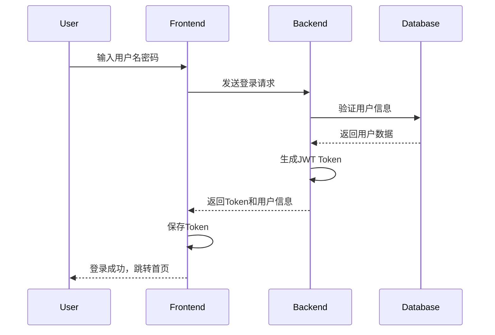
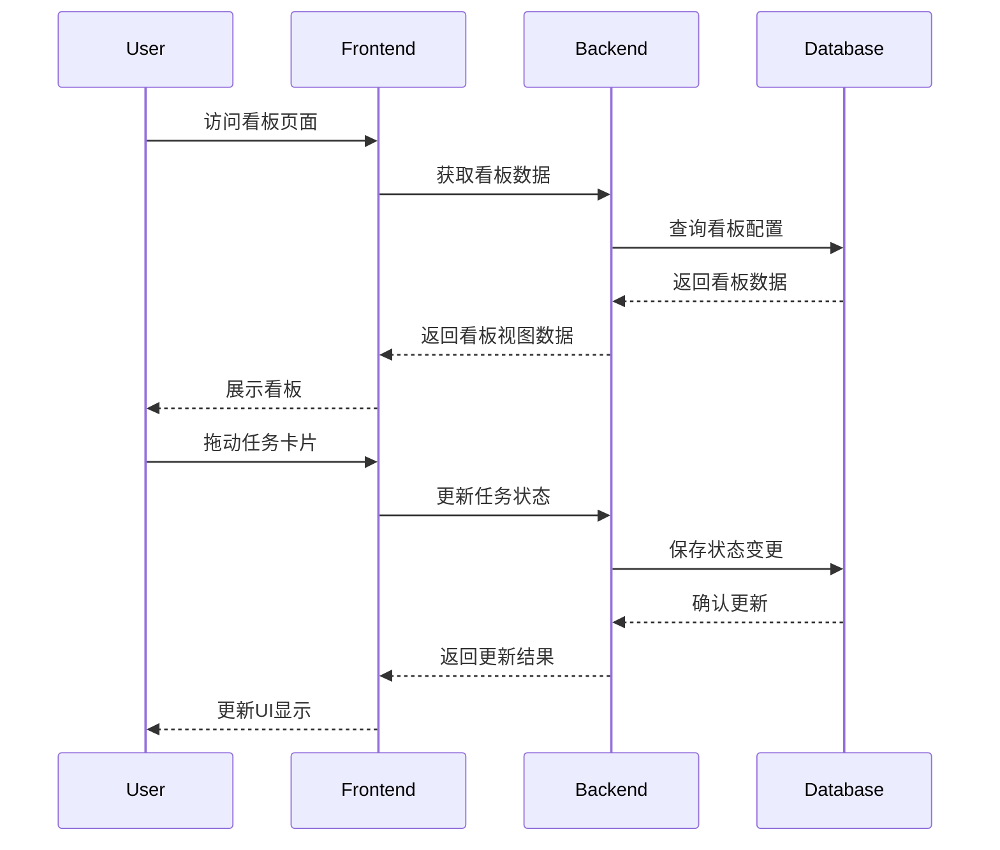
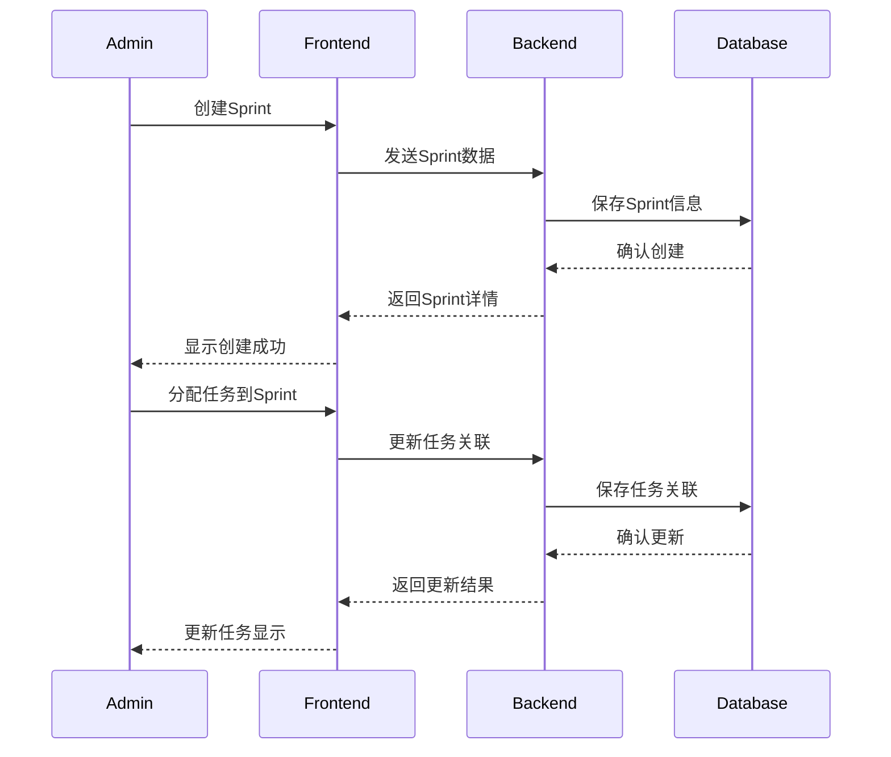
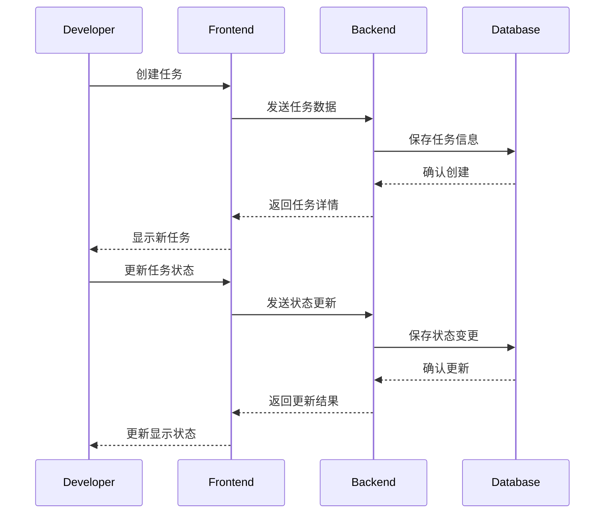

# GIRA项目功能设计文档

## 1. 系统功能模块

### 1.1 核心模块
1. 认证模块（Authentication）
   - 用户登录
   - Token管理
   - 权限验证

2. 用户模块（User）
   - 用户管理
   - 角色管理
   - 个人信息管理

3. 看板模块（Board）
   - 看板配置
   - 任务展示
   - 状态管理

4. Sprint模块（Sprint）
   - Sprint管理
   - 任务分配
   - 进度跟踪

5. 任务模块（Task）
   - 任务管理
   - 状态流转
   - 优先级管理

## 2. 功能流程设计

### 2.1 用户认证流程


### 2.2 看板操作流程


### 2.3 Sprint管理流程


### 2.4 任务管理流程


## 3. 权限控制矩阵

### 3.1 功能权限
| 功能模块 | 管理员 | 开发者 |
|---------|--------|--------|
| 用户管理 | ✓ | 仅自己 |
| 看板配置 | ✓ | × |
| Sprint管理 | ✓ | × |
| 任务创建 | ✓ | ✓ |
| 任务状态更新 | ✓ | ✓ |
| 任务删除 | ✓ | × |

### 3.2 数据权限
| 数据类型 | 管理员 | 开发者 |
|---------|--------|--------|
| 用户数据 | 所有 | 仅自己 |
| 看板数据 | 读写 | 只读 |
| Sprint数据 | 读写 | 只读 |
| 任务数据 | 所有 | 读写 |

## 4. 接口设计

### 4.1 认证接口
```
POST /api/auth/login
POST /api/auth/logout
POST /api/auth/refresh-token
```

### 4.2 用户接口
```
GET /api/users
POST /api/users
PUT /api/users/{id}
GET /api/users/{id}
PUT /api/users/{id}/password
```

### 4.3 看板接口
```
GET /api/boards
POST /api/boards
PUT /api/boards/{id}
GET /api/boards/{id}
GET /api/boards/{id}/columns
PUT /api/boards/{id}/columns
```

### 4.4 Sprint接口
```
GET /api/sprints
POST /api/sprints
PUT /api/sprints/{id}
GET /api/sprints/{id}
POST /api/sprints/{id}/start
POST /api/sprints/{id}/complete
```

### 4.5 任务接口
```
GET /api/tasks
POST /api/tasks
PUT /api/tasks/{id}
GET /api/tasks/{id}
DELETE /api/tasks/{id}
PUT /api/tasks/{id}/status
PUT /api/tasks/{id}/assignee
``` 