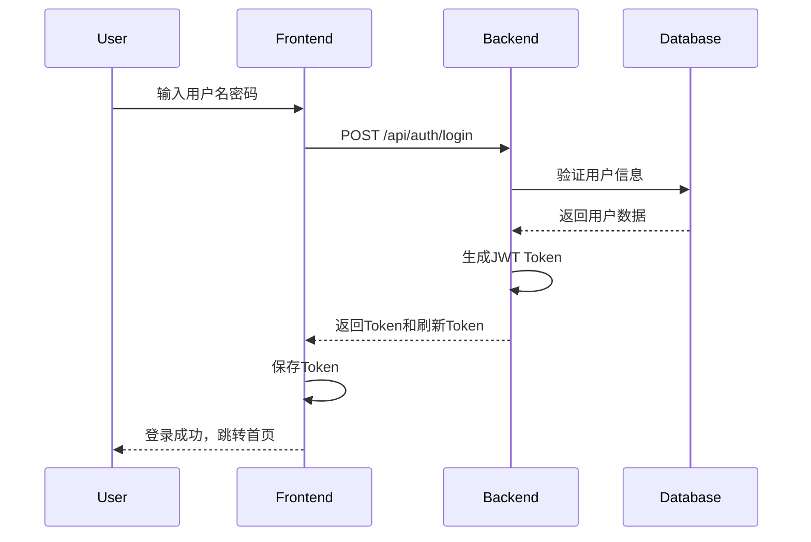
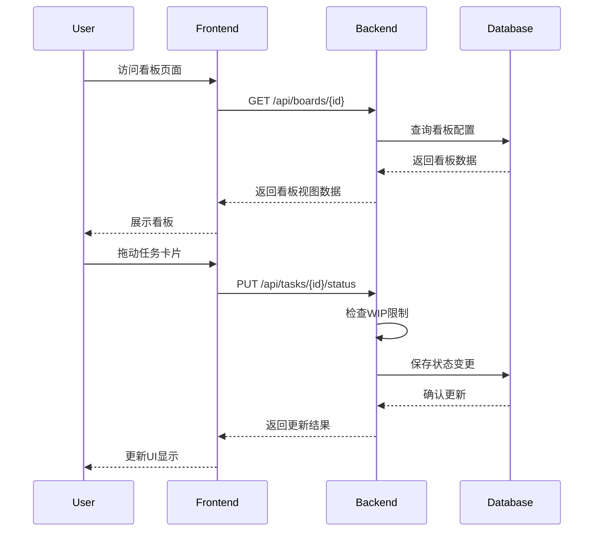
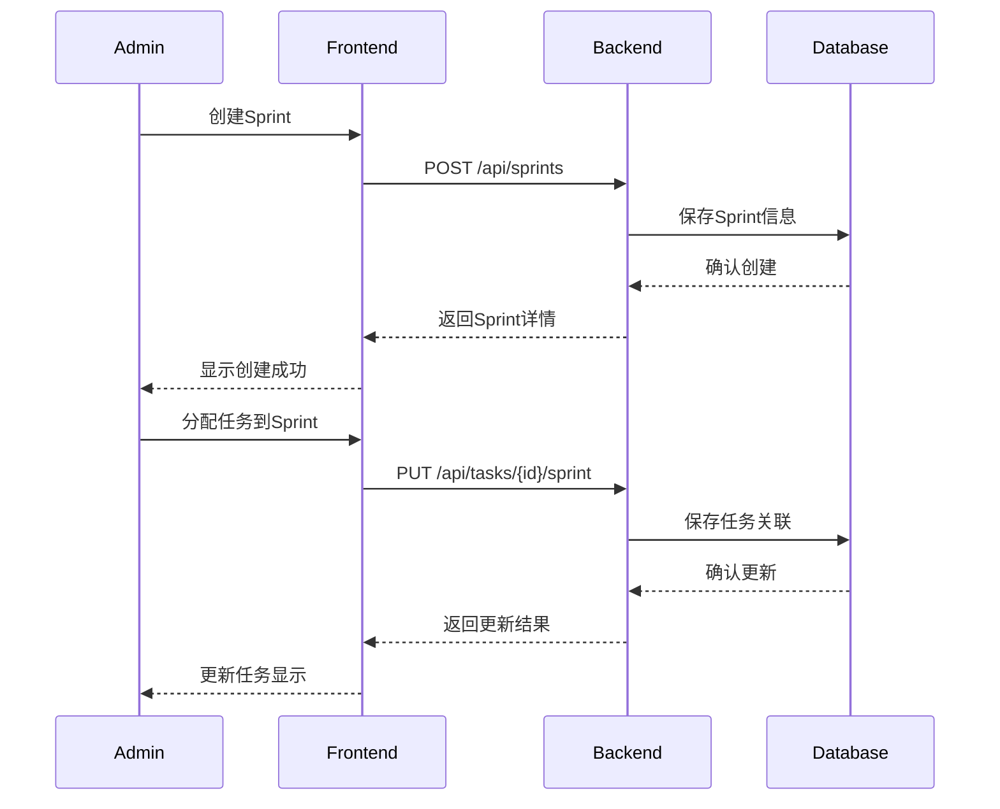
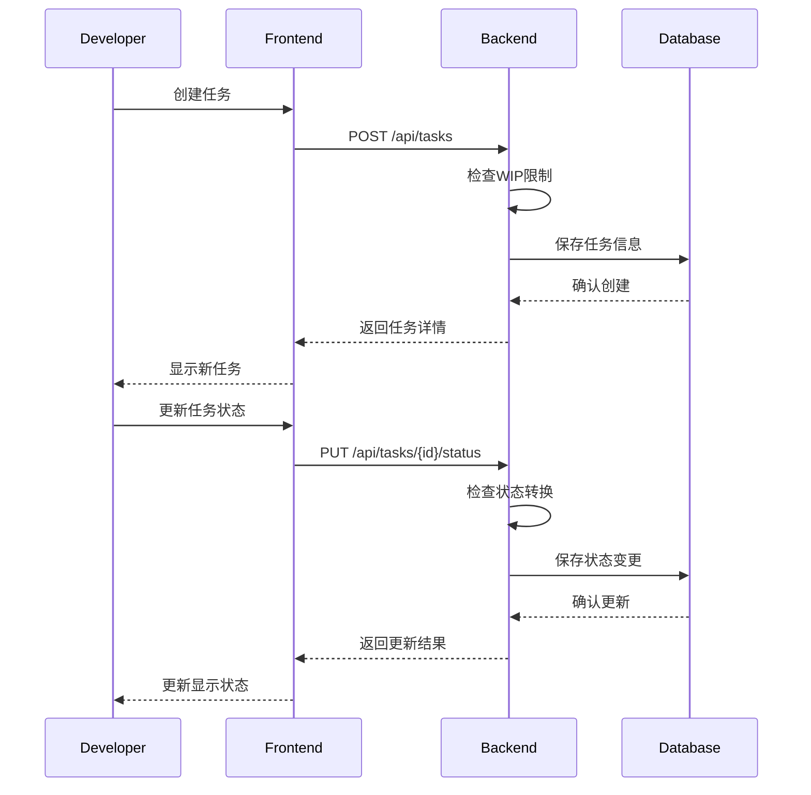

# GIRA项目功能设计文档

## 1. 系统功能模块

### 1.1 核心模块
1. 认证模块（Authentication）
   - 用户登录：用户名密码认证
   - Token管理：JWT访问令牌和刷新令牌
   - 权限验证：基于角色的访问控制

2. 用户模块（User）
   - 用户管理：创建、更新、删除用户
   - 角色管理：ADMIN、MANAGER、USER角色
   - 个人信息管理：密码修改、信息查看

3. 看板模块（Board）
   - 看板配置：创建、更新看板及其列
   - 任务展示：看板列和任务卡片
   - 状态管理：活动和归档状态

4. Sprint模块（Sprint）
   - Sprint管理：创建、更新、开始、完成
   - 任务分配：将任务分配到Sprint
   - 进度跟踪：Sprint状态和任务进度
   - 时间管理：开始日期和结束日期

5. 任务模块（Task）
   - 任务管理：创建、更新、删除任务
   - 状态流转：任务状态变更
   - 任务分配：指派任务给用户
   - 任务分类：Sprint任务和待办任务

## 2. 功能流程设计

### 2.1 用户认证流程


### 2.2 看板操作流程


### 2.3 Sprint管理流程


### 2.4 任务管理流程


## 3. 权限控制矩阵

### 3.1 功能权限
| 功能模块 | 管理员(ADMIN) | 经理(MANAGER) | 开发者(USER) |
|---------|--------------|--------------|-------------|
| 用户管理 | ✓ | × | 仅自己 |
| 看板配置 | ✓ | ✓ | × |
| Sprint管理 | ✓ | × | × |
| 任务创建 | ✓ | ✓ | ✓ |
| 任务状态更新 | ✓ | ✓ | ✓ |
| 任务删除 | ✓ | × | × |

### 3.2 数据权限
| 数据类型 | 管理员(ADMIN) | 经理(MANAGER) | 开发者(USER) |
|---------|--------------|--------------|-------------|
| 用户数据 | 所有 | 只读 | 仅自己 |
| 看板数据 | 读写 | 读写 | 只读 |
| Sprint数据 | 读写 | 只读 | 只读 |
| 任务数据 | 所有 | 读写 | 读写 |

## 4. 接口设计

### 4.1 认证接口
```
POST /api/auth/login          # 用户登录
POST /api/auth/logout         # 用户登出
POST /api/auth/refresh-token  # 刷新访问令牌
```

### 4.2 用户接口
```
POST /api/users              # 创建用户
PUT /api/users/{id}          # 更新用户
PUT /api/users/{id}/password # 修改密码
GET /api/users/{id}          # 获取用户详情
GET /api/users               # 获取用户列表
DELETE /api/users/{id}       # 删除用户
```

### 4.3 看板接口
```
POST /api/boards             # 创建看板
PUT /api/boards/{id}         # 更新看板
PUT /api/boards/{id}/columns # 更新看板列
GET /api/boards/{id}         # 获取看板详情
GET /api/boards              # 获取看板列表
PUT /api/boards/{id}/archive # 归档看板
GET /api/boards/{id}/tasks   # 获取看板任务
```

### 4.4 Sprint接口
```
POST /api/sprints                        # 创建Sprint
PUT /api/sprints/{id}                    # 更新Sprint
GET /api/sprints/{id}                    # 获取Sprint详情
PUT /api/sprints/{id}/start              # 开始Sprint
PUT /api/sprints/{id}/complete           # 完成Sprint
GET /api/sprints                         # 获取Sprint列表
GET /api/sprints/boards/{boardId}/sprints # 获取看板的Sprint列表
GET /api/sprints/{id}/tasks              # 获取Sprint的任务列表
```

### 4.5 任务接口
```
POST /api/tasks                    # 创建任务
PUT /api/tasks/{id}                # 更新任务
PUT /api/tasks/{id}/status         # 更新任务状态
GET /api/tasks/{id}                # 获取任务详情
GET /api/tasks                     # 获取任务列表
GET /api/tasks/backlog             # 获取待办任务
PUT /api/tasks/{id}/sprint         # 移动任务到Sprint
GET /api/tasks/boards/{boardId}    # 获取看板任务
GET /api/tasks/assignee/{assigneeId} # 获取指派的任务
DELETE /api/tasks/{id}             # 删除任务
```

### 看板功能
- 看板列管理：
  - 自定义列名称
  - 调整列顺序
  - 删除空列
- 任务拖拽：在不同列之间拖拽任务
- 看板统计：显示各列任务数量和完成情况 