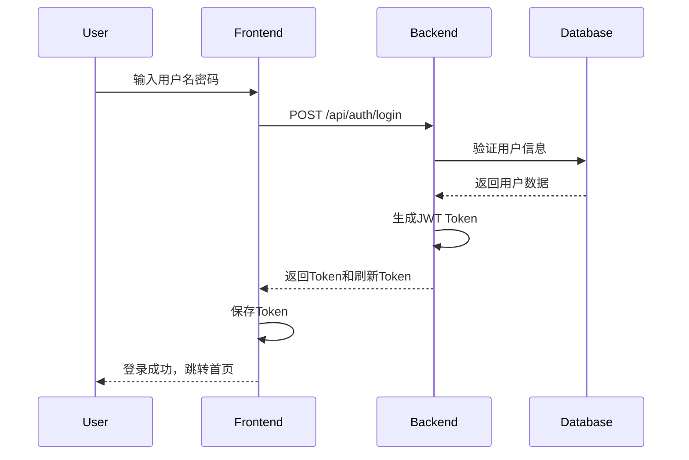
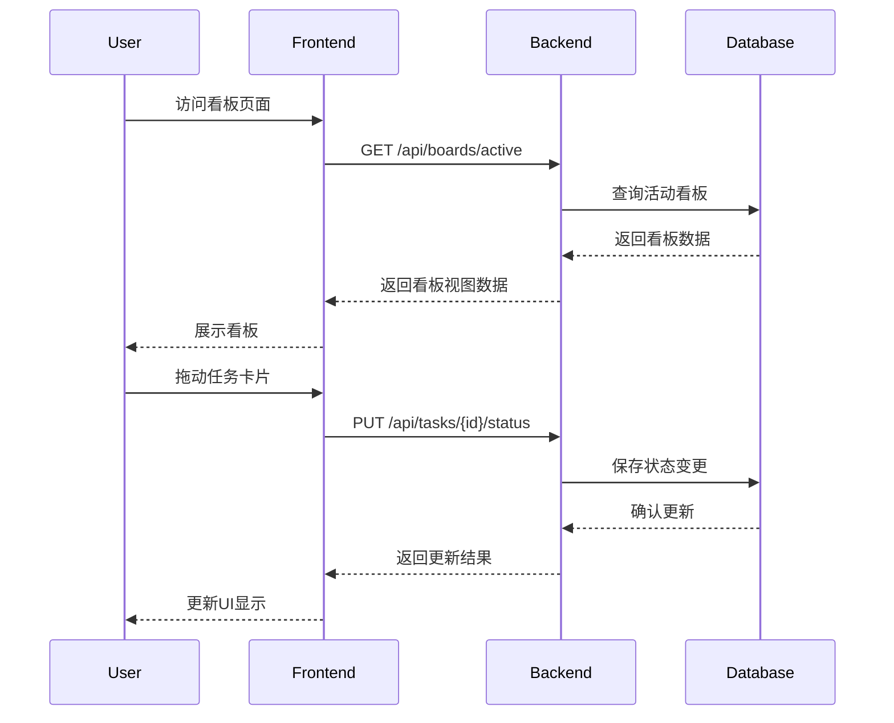
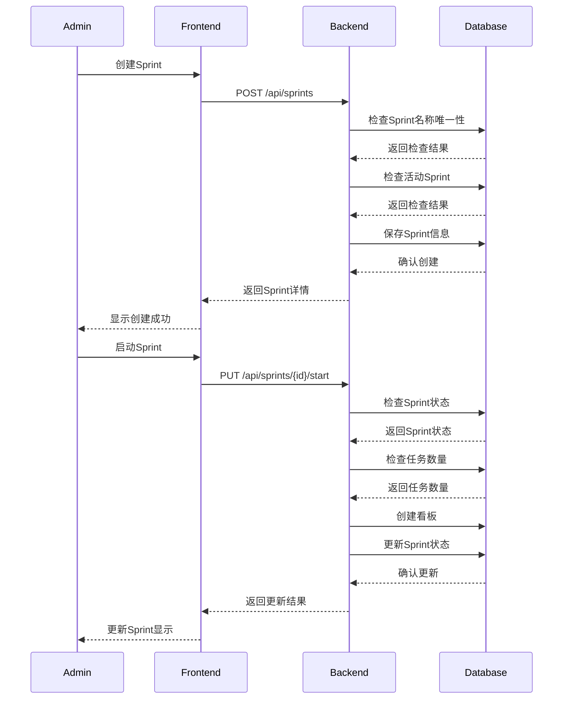
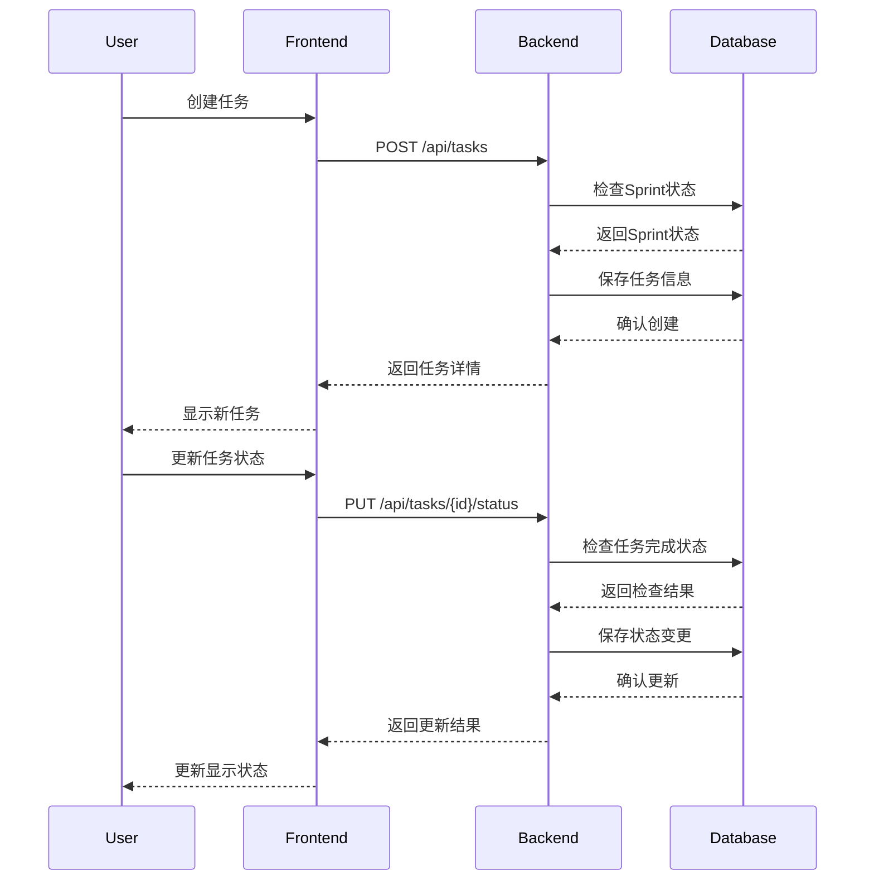

# GIRA项目功能设计文档

## 1. 系统功能模块

### 1.1 核心模块
1. 认证模块（Authentication）
   - 用户登录：用户名密码认证
   - Token管理：JWT访问令牌和刷新令牌
   - 权限验证：基于角色的访问控制

2. 用户模块（User）
   - 用户管理：创建、更新、删除用户（管理员）
   - 角色管理：ADMIN、DEVELOPER角色
   - 个人信息管理：密码修改、信息更新

3. 看板模块（Board）
   - 看板状态：活动(ACTIVE)和归档(ARCHIVED)
   - 固定三列：待办、进行中、已完成
   - 任务展示：看板列和任务卡片

4. Sprint模块（Sprint）
   - Sprint管理：创建、开始、完成（管理员）
   - Sprint状态：计划(PLANNING)、进行中(ACTIVE)、已完成(COMPLETED)
   - 时间管理：开始日期和结束日期

5. 任务模块（Task）
   - 任务管理：创建（Sprint中）、更新、删除任务
   - 状态流转：待办、进行中、已完成
   - 任务分配：指派任务给用户
   - 优先级设置：高、中、低

## 2. 功能流程设计

### 2.1 用户认证流程


### 2.2 看板操作流程


### 2.2 Sprint管理流程


### 2.3 Sprint业务规则

1. Sprint创建规则
   - Sprint名称必须唯一
   - Sprint持续时间不能超过4周
   - 结束日期必须晚于开始日期
   - 同一时间只能有一个活动Sprint

2. Sprint启动规则
   - 只能启动PLANNING状态的Sprint
   - Sprint必须包含至少一个任务
   - 启动时自动创建关联看板
   - 不能有其他活动Sprint

3. Sprint完成规则
   - 只能完成ACTIVE状态的Sprint
   - 完成时自动完成所有未完成任务
   - 完成时自动归档关联看板

4. Sprint更新规则
   - 只能修改PLANNING状态的Sprint
   - 更新名称时检查唯一性
   - 持续时间不能超过4周
   - 结束日期必须晚于开始日期

### 2.4 任务管理流程


## 3. 权限控制矩阵

### 3.1 功能权限
| 功能模块 | 管理员(ADMIN) | 开发者(DEVELOPER) |
|---------|--------------|-----------------|
| 用户管理 | ✓ | 仅自己 |
| 看板配置 | ✓ | × |
| Sprint管理 | ✓ | × |
| 任务创建 | ✓ | ✓ |
| 任务状态更新 | ✓ | ✓ |
| 任务删除 | ✓ | × |

### 3.2 数据权限
| 数据类型 | 管理员(ADMIN) | 开发者(DEVELOPER) |
|---------|--------------|-----------------|
| 用户数据 | 所有 | 仅自己 |
| 看板数据 | 读写 | 只读 |
| Sprint数据 | 读写 | 只读 |
| 任务数据 | 所有 | 读写未完成任务 |

## 4. 接口设计

### 4.1 认证接口
```
POST /api/auth/login          # 用户登录
POST /api/auth/logout         # 用户登出
POST /api/auth/refresh-token  # 刷新访问令牌
```

### 4.2 用户接口
```
POST /api/users              # 创建用户（管理员）
PUT /api/users/{id}          # 更新用户（管理员或自己）
PUT /api/users/{id}/password # 修改密码
GET /api/users/{id}          # 获取用户详情
GET /api/users               # 获取用户列表（管理员）
DELETE /api/users/{id}       # 删除用户（管理员）
```

### 4.3 看板接口
```
# 看板管理接口
PUT /api/boards/{id}         # 更新看板基本信息（管理员）
GET /api/boards/active       # 获取活动看板
GET /api/boards              # 获取看板列表（支持分页）
PUT /api/boards/{id}/archive # 归档看板（管理员）
GET /api/boards/{id}/tasks   # 获取看板任务

# 分页参数（适用于获取看板列表）
page: 页码（从0开始）
size: 每页大小
sort: 排序字段（默认createdAt）
direction: 排序方向（ASC/DESC）
```

### 4.4 Sprint接口
```
# Sprint管理接口
POST /api/sprints                    # 创建Sprint（管理员）
PUT /api/sprints/{id}                # 更新Sprint（管理员）
GET /api/sprints/{id}                # 获取Sprint详情
PUT /api/sprints/{id}/start          # 启动Sprint（管理员）
PUT /api/sprints/{id}/complete       # 完成Sprint（管理员）
GET /api/sprints?status={status}     # 获取Sprint列表（支持分页）
GET /api/sprints/{id}/tasks          # 获取Sprint的任务列表

# 分页参数（适用于获取Sprint列表）
page: 页码（从0开始）
size: 每页大小
sort: 排序字段（默认createdAt）
direction: 排序方向（ASC/DESC）

# 请求/响应示例

## 创建Sprint请求
{
    "name": "string",      // 必填，Sprint名称
    "startDate": "date",   // 必填，开始日期
    "endDate": "date"      // 必填，结束日期
}

## Sprint列表响应（分页）
{
    "content": [           // Sprint列表
        {
            "id": "number",
            "name": "string",
            "startDate": "date",
            "endDate": "date",
            "status": "string",
            "createdBy": {
                "id": "number",
                "username": "string",
                "fullName": "string"
            },
            "createdAt": "datetime"
        }
    ],
    "totalElements": 0,    // 总记录数
    "totalPages": 0,       // 总页数
    "size": 10,           // 每页大小
    "number": 0,          // 当前页码
    "sort": {             // 排序信息
        "sorted": true,
        "unsorted": false,
        "empty": false
    },
    "first": true,        // 是否第一页
    "last": true,         // 是否最后一页
    "empty": true         // 是否为空
}

## Sprint任务列表响应
[
    {
        "id": "number",
        "title": "string",
        "description": "string",
        "status": "string",
        "priority": "string",
        "assignee": {
            "id": "number",
            "username": "string",
            "fullName": "string"
        },
        "createdAt": "datetime"
    }
]
```

### 4.5 任务接口
```