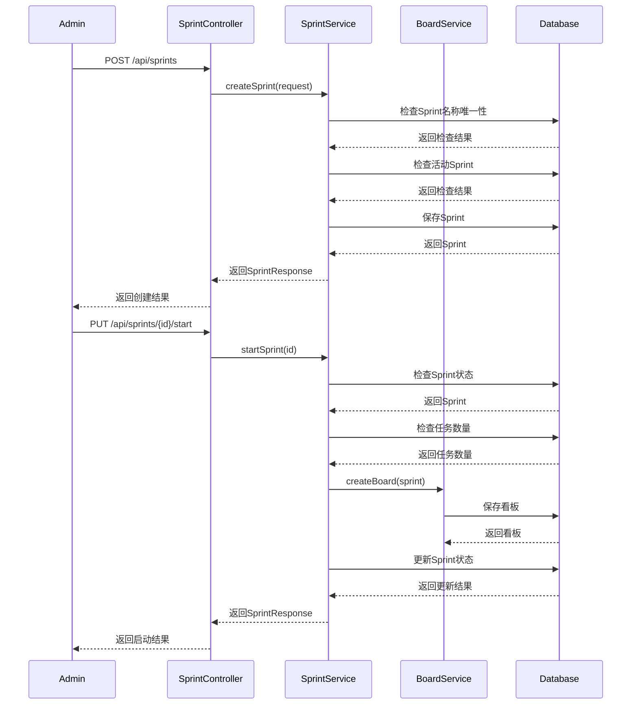
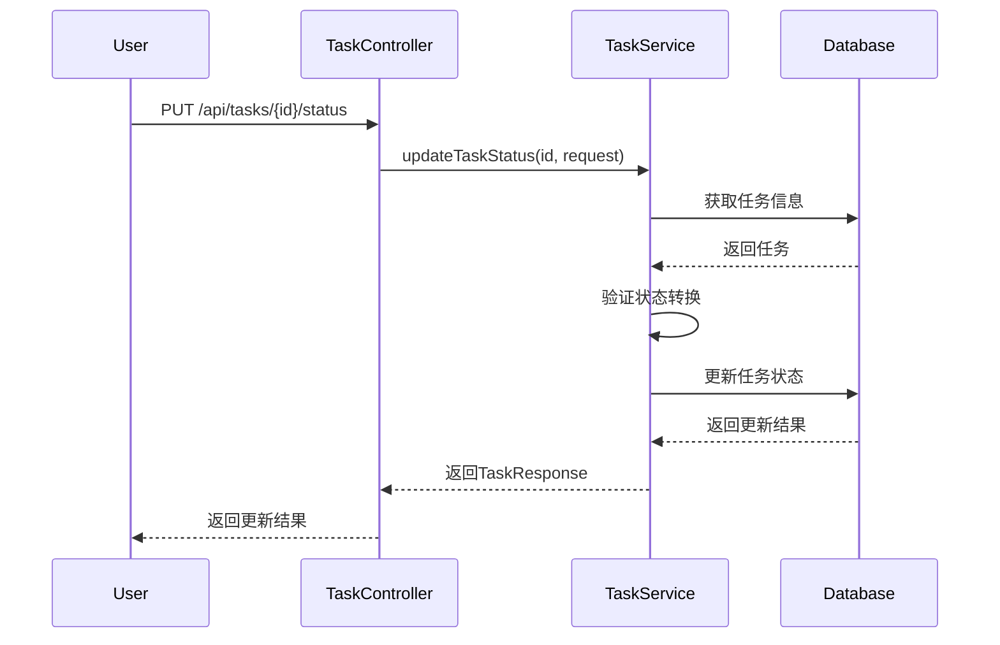
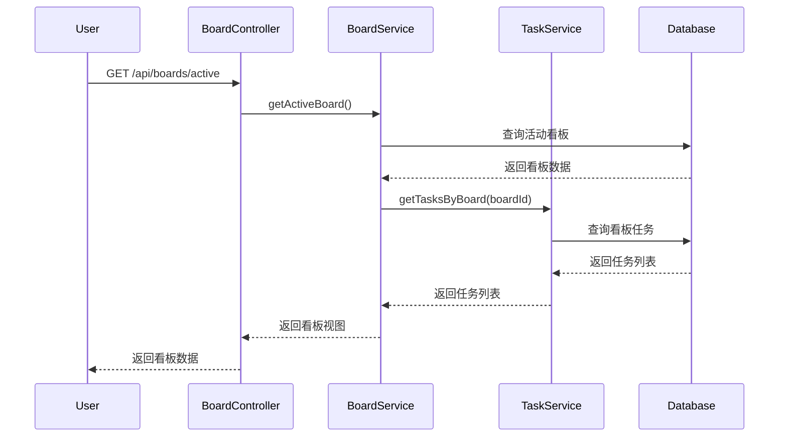

# GIRA后台详细设计文档

## 1. 系统架构设计

### 1.1 技术栈选型
- 核心框架：Spring Boot 3.2.0
- JDK版本：OpenJDK 21
- 安全框架：Spring Security + JWT
- 数据访问：Spring Data JPA
- 数据库：PostgreSQL 14
- 对象映射：MapStruct 1.5.5.Final
- 代码简化：Lombok 1.18.30
- API文档：SpringDoc OpenAPI 2.3.0

### 1.2 系统分层
1. 表现层（Controller）
   - REST API接口实现
   - 请求参数验证
   - 响应数据封装

2. 业务层（Service）
   - 业务逻辑处理
   - 事务管理
   - 权限校验

3. 数据访问层（Repository）
   - 数据库操作
   - 查询优化

4. 公共层（Common）
   - 工具类
   - 常量定义
   - 异常处理

### 1.3 权限控制设计

#### 1.3.1 功能权限矩阵

| 功能模块 | 管理员(ADMIN) | 开发者(DEVELOPER) |
|---------|--------------|-----------------|
| 用户管理 | ✓ | 仅自己 |
| 看板配置 | ✓ | × |
| Sprint管理 | ✓ | × |
| 任务创建 | ✓ | ✓ |
| 任务状态更新 | ✓ | ✓ |
| 任务删除 | ✓ | × |

#### 1.3.2 数据权限矩阵

| 数据类型 | 管理员(ADMIN) | 开发者(DEVELOPER) |
|---------|--------------|-----------------|
| 用户数据 | 所有 | 仅自己 |
| 看板数据 | 读写 | 只读 |
| Sprint数据 | 读写 | 只读 |
| 任务数据 | 所有 | 读写未完成任务 |

#### 1.3.3 权限实现方案

1. 注解式权限控制
```java
// 角色级别权限
@PreAuthorize("hasRole('ADMIN')")
public SprintResponse createSprint(CreateSprintRequest request) {}

// 资源级别权限
@PreAuthorize("hasRole('ADMIN') or #userId == authentication.principal.id")
public UserResponse updateUser(Long userId, UpdateUserRequest request) {}
```

2. 程序式权限控制
```java
@Service
public class TaskServiceImpl {
    public TaskResponse updateTask(Long id, UpdateTaskRequest request) {
        Task task = getTaskOrThrow(id);
        User currentUser = getCurrentUser();
        
        // 检查任务权限
        if (!isTaskEditable(task, currentUser)) {
            throw new AccessDeniedException("无权限修改此任务");
        }
        // ... 更新任务
    }
    
    private boolean isTaskEditable(Task task, User user) {
        return user.getRole() == UserRole.ADMIN || 
               (task.getStatus() != TaskStatus.DONE && 
                (task.getAssignee() == null || task.getAssignee().equals(user)));
    }
}
```

### 1.4 前后端交互设计

#### 1.4.1 统一响应格式
```json
{
    "code": 200,           // 状态码
    "message": "success",  // 响应消息
    "data": {             // 响应数据
        // 具体的业务数据
    },
    "timestamp": "2024-01-14T10:00:00Z"  // 响应时间
}
```

#### 1.4.2 错误响应格式
```json
{
    "code": 400,          // HTTP状态码
    "message": "错误信息", // 错误描述
    "errors": [           // 详细错误信息（表单验证等）
        {
            "field": "username",
            "message": "用户名不能为空"
        }
    ],
    "timestamp": "2024-01-14T10:00:00Z"
}
```

#### 1.4.3 分页响应格式
```json
{
    "content": [],           // 分页数据
    "totalElements": 0,      // 总记录数
    "totalPages": 0,         // 总页数
    "size": 10,             // 每页大小
    "number": 0,            // 当前页码
    "sort": {               // 排序信息
        "sorted": true,
        "unsorted": false,
        "empty": false
    },
    "first": true,          // 是否第一页
    "last": true,           // 是否最后一页
    "empty": true           // 是否为空
}
```

### 1.5 核心业务流程

#### 1.5.1 Sprint创建和启动流程


#### 1.5.2 任务状态更新流程


#### 1.5.3 看板操作流程


## 2. 用户认证与权限

### 2.1 角色定义
```java
public enum UserRole {
    ADMIN,      // 管理员
    DEVELOPER   // 开发者
}
```

### 2.2 认证接口设计
1. 用户登录
- 路径: `POST /api/auth/login`
- 功能: 用户登录并获取JWT令牌
- 权限: 无需权限
- 请求体:
```json
{
    "username": "string",
    "password": "string"
}
```
- 响应体:
```json
{
    "token": "string",
    "refreshToken": "string",
    "expiresIn": "number"
}
```

2. 刷新令牌
- 路径: `POST /api/auth/refresh`
- 功能: 使用刷新令牌获取新的访问令牌
- 权限: 无需权限
- 请求体:
```json
{
    "refreshToken": "string"
}
```

3. 退出登录
- 路径: `POST /api/auth/logout`
- 功能: 使当前令牌失效
- 权限: 已登录用户

### 2.3 权限控制设计
- 管理员权限：只有管理员可以访问
- 开发者或管理员权限：开发者和管理员都可以访问
- 用户资源权限：用户只能访问自己的资源，管理员可以访问所有资源

## 3. Sprint管理

### 3.1 数据模型设计

```java
@Entity
@Table(name = "sprints", uniqueConstraints = {
    @UniqueConstraint(columnNames = "name")
})
public class Sprint extends BaseEntity {
    @Id
    @GeneratedValue(strategy = GenerationType.IDENTITY)
    private Long id;

    @Column(nullable = false, unique = true)
    private String name;

    private LocalDate startDate;
    private LocalDate endDate;

    @Enumerated(EnumType.STRING)
    @Column(nullable = false)
    private SprintStatus status = SprintStatus.PLANNING;

    @ManyToOne(fetch = FetchType.LAZY)
    @JoinColumn(name = "board_id")
    private Board board;

    @ManyToOne(fetch = FetchType.LAZY)
    @JoinColumn(name = "created_by", nullable = false)
    private User createdBy;
}

public enum SprintStatus {
    PLANNING,   // 计划阶段
    ACTIVE,     // 进行中
    COMPLETED   // 已完成
}
```

### 3.2 Sprint业务规则

1. Sprint名称唯一性
   - Sprint名称在系统中必须唯一
   - 创建和更新Sprint时都会检查名称唯一性

2. Sprint时间限制
   - Sprint持续时间不能超过4周（28天）
   - 结束日期必须晚于开始日期
   - 开始日期没有限制

3. Sprint状态管理
   - 同一时间只能有一个活动(ACTIVE)状态的Sprint
   - Sprint状态流转：PLANNING -> ACTIVE -> COMPLETED
   - 只能启动PLANNING状态的Sprint
   - 只能完成ACTIVE状态的Sprint

4. Sprint与看板关联
   - Sprint创建时不需要关联看板
   - Sprint启动时自动创建并关联新的看板
   - Sprint完成时自动归档关联的看板

5. Sprint与任务关联
   - Sprint必须包含至少一个任务才能启动
   - Sprint完成时自动完成所有未完成的任务

### 3.3 Sprint接口设计

1. 创建Sprint
- 路径: `POST /api/sprints`
- 功能: 创建新的Sprint
- 权限: 仅管理员
- 请求体:
```json
{
    "name": "string",      // 必填，Sprint名称
    "startDate": "date",   // 必填，开始日期
    "endDate": "date"      // 必填，结束日期
}
```
- 响应体:
```json
{
    "id": "number",
    "name": "string",
    "startDate": "date",
    "endDate": "date",
    "status": "string",    // PLANNING/ACTIVE/COMPLETED
    "createdBy": {
        "id": "number",
        "username": "string",
        "fullName": "string"
    },
    "createdAt": "datetime"
}
```
- 业务规则:
  - 检查Sprint名称唯一性
  - 检查Sprint持续时间不超过4周
  - 检查是否存在活动Sprint
  - 设置初始状态为PLANNING

2. 启动Sprint
- 路径: `PUT /api/sprints/{id}/start`
- 功能: 将Sprint状态改为ACTIVE
- 权限: 仅管理员
- 业务规则:
  - 检查Sprint状态必须为PLANNING
  - 检查是否存在其他活动Sprint
  - 检查Sprint是否包含任务
  - 自动创建关联看板

3. 完成Sprint
- 路径: `PUT /api/sprints/{id}/complete`
- 功能: 将Sprint状态改为COMPLETED
- 权限: 仅管理员
- 业务规则:
  - 检查Sprint状态必须为ACTIVE
  - 自动完成所有未完成任务
  - 归档关联看板

4. 更新Sprint
- 路径: `PUT /api/sprints/{id}`
- 功能: 更新Sprint基本信息
- 权限: 仅管理员
- 请求体:
```json
{
    "name": "string",      // Sprint名称
    "startDate": "date",   // 开始日期
    "endDate": "date"      // 结束日期
}
```
- 业务规则:
  - 只能修改PLANNING状态的Sprint
  - 检查Sprint名称唯一性（如果修改）
  - 检查Sprint持续时间不超过4周
  - 检查结束日期晚于开始日期

5. 查询Sprint
- 获取Sprint详情: `GET /api/sprints/{id}`
- 获取Sprint列表: `GET /api/sprints?status={status}`
  - 参数: status - PLANNING/ACTIVE/COMPLETED
- 获取Sprint任务: `GET /api/sprints/{id}/tasks`
- 权限: 所有用户

6. 错误处理
```json
{
    "status": 400,
    "message": "错误信息",
    "timestamp": "datetime"
}
```

常见错误信息：
- "Sprint名称已存在"
- "Sprint中没有任务，无法启动"
- "已存在活动中的Sprint"
- "只能启动计划中的Sprint"
- "只能完成活动中的Sprint"
- "Sprint持续时间不能超过4周"
- "结束日期必须在开始日期之后"

### 3.4 Sprint响应对象
```java
public class SprintResponse {
    private Long id;
    private String name;
    private LocalDate startDate;
    private LocalDate endDate;
    private SprintStatus status;
    private UserResponse createdBy;
    private LocalDateTime createdAt;
}
```

### 3.4 分页支持

系统仅在以下查询接口支持分页：

1. 看板列表查询
   - 接口：GET /api/boards
   - 实现：BoardRepository.findAll(Pageable pageable)
   - 默认排序：按创建时间降序

2. Sprint列表查询
   - 接口：GET /api/sprints
   - 实现：SprintRepository.findAll(Pageable pageable)
   - 默认排序：按创建时间降序

其他查询接口均返回完整列表（List），不支持分页。

分页参数说明：
```
page: 页码，从0开始
size: 每页记录数，默认10
sort: 排序字段，默认createdAt
direction: 排序方向，ASC（升序）/DESC（降序），默认DESC
```

分页响应格式：
```json
{
    "content": [],           // 当前页数据
    "totalElements": 0,      // 总记录数
    "totalPages": 0,         // 总页数
    "size": 10,             // 每页大小
    "number": 0,            // 当前页码
    "sort": {               // 排序信息
        "sorted": true,
        "unsorted": false,
        "empty": false
    },
    "first": true,          // 是否第一页
    "last": true,           // 是否最后一页
    "empty": true           // 是否为空
}
```

## 4. 看板管理

### 4.1 数据模型设计

```java
@Entity
@Table(name = "boards")
public class Board extends BaseEntity {
    @Id
    @GeneratedValue(strategy = GenerationType.IDENTITY)
    private Long id;

    @Column(nullable = false)
    private String name;

    private String description;

    @Enumerated(EnumType.STRING)
    @Column(nullable = false)
    private BoardStatus status = BoardStatus.ACTIVE;

    @ManyToOne(fetch = FetchType.LAZY)
    @JoinColumn(name = "created_by", nullable = false)
    private User createdBy;
}

public enum BoardStatus {
    ACTIVE,    // 活动状态
    ARCHIVED   // 已归档
}
```

### 4.2 看板业务规则

1. 看板名称唯一性
   - 看板名称在系统中必须唯一
   - 创建和更新看板时都会检查名称唯一性

2. 看板状态管理
   - 看板状态与Sprint状态同步
   - Sprint启动时自动创建活动看板
   - Sprint完成时自动归档看板
   - 已归档的看板不能修改

3. 权限控制
   - 管理员可以修改看板信息
   - 开发者只能查看看板

### 4.3 看板接口设计

1. 更新看板
- 路径: `PUT /api/boards/{id}`
- 功能: 更新看板基本信息
- 权限: 仅管理员
- 请求体:
```json
{
    "name": "string",        // 看板名称
    "description": "string"  // 看板描述
}
```
- 业务规则:
  - 检查看板是否已归档
  - 检查看板名称唯一性（如果修改）

2. 查询看板
- 获取看板详情: `GET /api/boards/{id}`
- 获取看板列表: `GET /api/boards?status={status}`
  - 参数: status - ACTIVE/ARCHIVED
- 权限: 所有用户

## 5. 任务管理

### 5.1 数据模型设计

```java
@Entity
@Table(name = "tasks")
public class Task extends BaseEntity {
    @Id
    @GeneratedValue(strategy = GenerationType.IDENTITY)
    private Long id;

    @Column(nullable = false)
    private String title;

    @Column(columnDefinition = "TEXT")
    private String description;

    @ManyToOne(fetch = FetchType.LAZY)
    @JoinColumn(name = "sprint_id")
    private Sprint sprint;

    @ManyToOne(fetch = FetchType.LAZY)
    @JoinColumn(name = "assignee_id")
    private User assignee;

    @ManyToOne(fetch = FetchType.LAZY)
    @JoinColumn(name = "reporter_id", nullable = false)
    private User reporter;

    @Enumerated(EnumType.STRING)
    @Column(nullable = false)
    private TaskPriority priority = TaskPriority.MEDIUM;

    @Enumerated(EnumType.STRING)
    @Column(nullable = false)
    private TaskStatus status = TaskStatus.TODO;
}

public enum TaskStatus {
    TODO,         // 待办
    IN_PROGRESS,  // 进行中
    DONE         // 已完成
}

public enum TaskPriority {
    LOW,    // 低优先级
    MEDIUM, // 中优先级
    HIGH    // 高优先级
}
```

### 5.2 任务业务规则

1. 任务状态流转规则
   - TODO -> IN_PROGRESS
   - IN_PROGRESS -> DONE 或 TODO
   - DONE状态的任务不能再变更状态

2. 任务创建规则
   - 必须在Sprint中创建任务
   - 只能在PLANNING或ACTIVE状态的Sprint中创建任务
   - 创建时必须指定标题
   - 创建者自动成为reporter
   - 可以选择性指定执行人(assignee)

3. 任务更新规则
   - 可以更新标题、描述、优先级
   - 可以更改执行人
   - 可以在Sprint间移动任务(仅限PLANNING或ACTIVE状态的Sprint)
   - 已完成的任务不能更新状态

4. 任务删除规则
   - 只有管理员可以删除任务
   - Sprint完成时自动完成所有未完成的任务

### 5.3 任务接口设计

1. 创建任务
- 路径: `POST /api/tasks`
- 功能: 创建新任务
- 权限: 所有用户
- 请求体:
```json
{
    "title": "string",       // 必填，任务标题
    "description": "string", // 任务描述
    "sprintId": "number",    // 必填，所属Sprint ID
    "assigneeId": "number",  // 可选，执行人ID
    "priority": "string"     // 可选，优先级(LOW/MEDIUM/HIGH)
}
```
- 业务规则:
  - 检查Sprint是否存在且状态有效
  - 检查执行人是否存在（如果指定）
  - 设置当前用户为reporter

2. 更新任务
- 路径: `PUT /api/tasks/{id}`
- 功能: 更新任务基本信息
- 权限: 所有用户
- 请求体:
```json
{
    "title": "string",       // 任务标题
    "description": "string", // 任务描述
    "assigneeId": "number",  // 执行人ID
    "priority": "string"     // 优先级
}
```

3. 更新任务状态
- 路径: `PUT /api/tasks/{id}/status`
- 功能: 更新任务状态
- 权限: 所有用户
- 请求体:
```json
{
    "status": "string"  // 新状态(TODO/IN_PROGRESS/DONE)
}
```
- 业务规则:
  - 检查状态转换是否有效
  - 已完成任务不能更新状态

4. 移动任务
- 路径: `PUT /api/tasks/{id}/sprint/{sprintId}`
- 功能: 将任务移动到其他Sprint
- 权限: 所有用户
- 业务规则:
  - 只能移动到PLANNING或ACTIVE状态的Sprint

5. 查询任务
- 获取任务详情: `GET /api/tasks/{id}`
- 获取执行人的任务: `GET /api/tasks/assignee/{assigneeId}`
- 获取Sprint的任务: `GET /api/sprints/{id}/tasks`
- 权限: 所有用户

6. 删除任务
- 路径: `DELETE /api/tasks/{id}`
- 功能: 删除任务
- 权限: 仅管理员

7. 错误处理
```json
{
    "status": 400,
    "message": "错误信息",
    "timestamp": "datetime"
}
```

常见错误信息：
- "任务必须在Sprint中创建"
- "只能将任务添加到计划中或活动中的Sprint"
- "无效的状态变更"
- "已完成的任务不能更新状态"
- "指派人不存在"
- "Sprint不存在"

## 6. 用户管理

### 6.1 数据模型设计
```java
@Entity
@Table(name = "users")
public class User {
    @Id
    @GeneratedValue(strategy = GenerationType.IDENTITY)
    private Long id;

    @Column(nullable = false, unique = true)
    private String username;

    @Column(nullable = false)
    private String password;

    @Column(nullable = false)
    @Enumerated(EnumType.STRING)
    private UserRole role;

    @Column(nullable = false)
    private String email;

    private String fullName;
}
```

### 6.2 用户管理接口设计
1. 创建用户
- 路径: `POST /api/users`
- 功能: 创建新用户
- 权限: 仅管理员
- 请求体:
```json
{
    "username": "string",
    "password": "string",
    "email": "string",
    "fullName": "string",
    "role": "string"  // ADMIN/DEVELOPER
}
```

2. 更新用户信息
- 路径: `PUT /api/users/{id}`
- 功能: 更新用户基本信息
- 权限: 管理员或用户本人
- 请求体:
```json
{
    "email": "string",
    "fullName": "string"
}
```

3. 修改密码
- 路径: `PUT /api/users/{id}/password`
- 功能: 修改用户密码
- 权限: 管理员或用户本人
- 请求体:
```json
{
    "oldPassword": "string",
    "newPassword": "string"
}
```

4. 获取用户列表
- 路径: `GET /api/users`
- 功能: 获取用户列表
- 权限: 仅管理员
- 查询参数:
  - page: 页码
  - size: 每页大小
  - role: 用户角色过滤

5. 获取用户详情
- 路径: `GET /api/users/{id}`
- 功能: 获取用户详细信息
- 权限: 管理员或用户本人

6. 删除用户
- 路径: `DELETE /api/users/{id}`
- 功能: 删除用户
- 权限: 仅管理员 