# GIRA 业务功能详细设计文档

## 1. 用户认证模块

### 1.1 登录流程
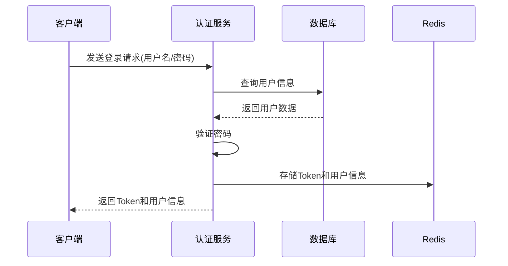

### 1.2 注册流程
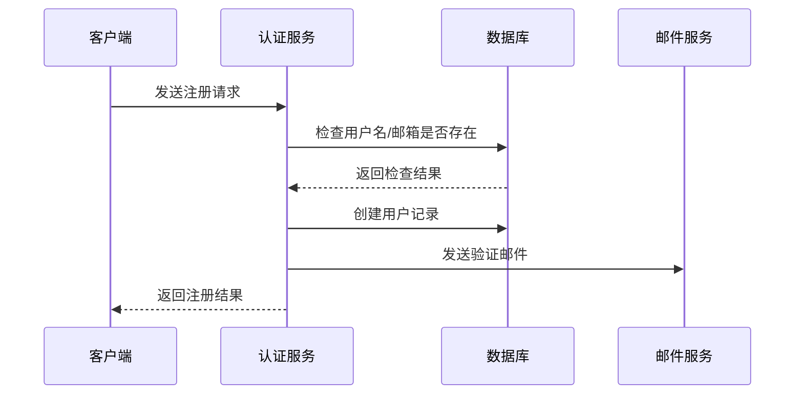

### 1.3 权限控制
- 基于RBAC（Role-Based Access Control）模型
- 角色层级：
  - 系统管理员（ADMIN）
  - 项目经理（MANAGER）
  - 普通用户（USER）
- 权限粒度：
  - 系统级权限
  - 项目级权限
  - 功能级权限

## 2. 项目管理模块

### 2.1 项目创建流程
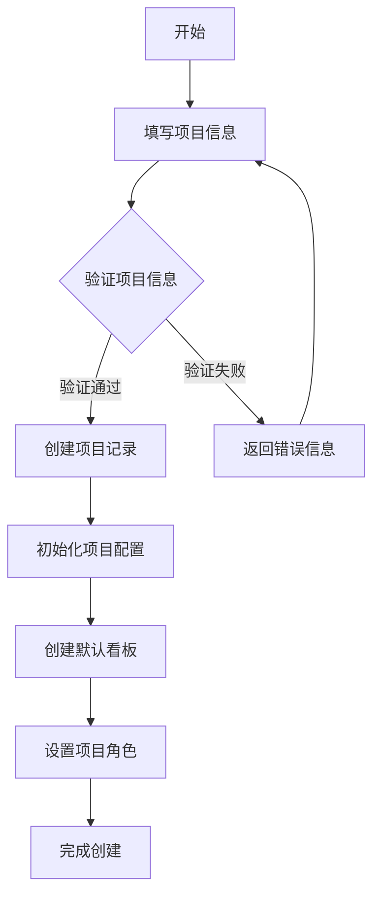

### 2.2 项目配置管理
- 基本信息配置
  - 项目名称
  - 项目代码
  - 描述信息
  - 项目图标
- 团队管理
  - 成员邀请
  - 角色分配
  - 权限设置
- 工作流配置
  - 状态定义
  - 工作流规则
  - 自动化配置

## 3. 需求管理模块（Backlog）

### 3.1 需求创建流程
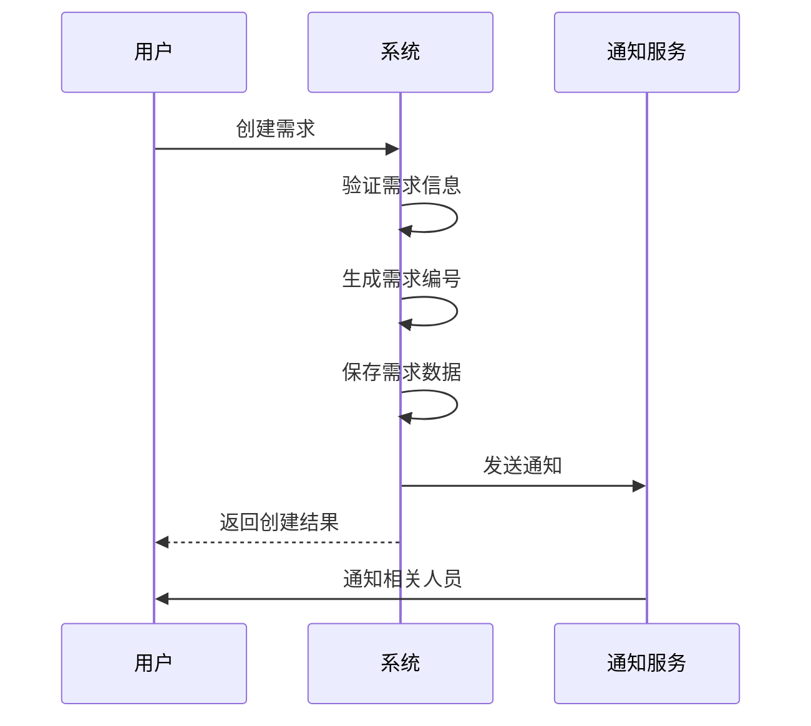

### 3.2 需求状态流转
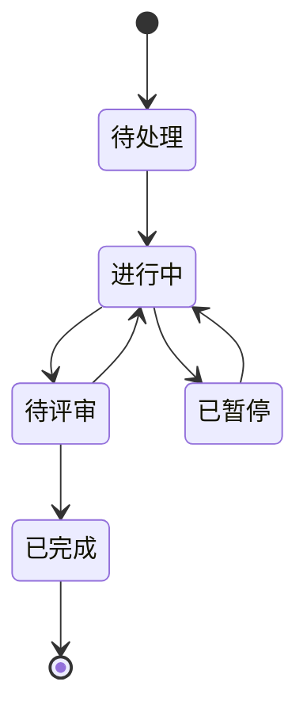

### 3.3 需求优先级管理
- 优先级定义：
  - P0：紧急
  - P1：高
  - P2：中
  - P3：低
- 优先级调整规则
- 优先级显示和排序

## 4. 看板模块

### 4.1 看板操作流程
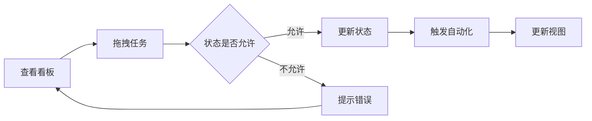

### 4.2 看板配置
- 列配置
  - 添加/删除列
  - 列名称设置
  - WIP限制
- 泳道配置
  - 按经办人
  - 按优先级
  - 按标签
- 过滤器配置
  - 条件设置
  - 视图保存

### 4.3 自动化规则
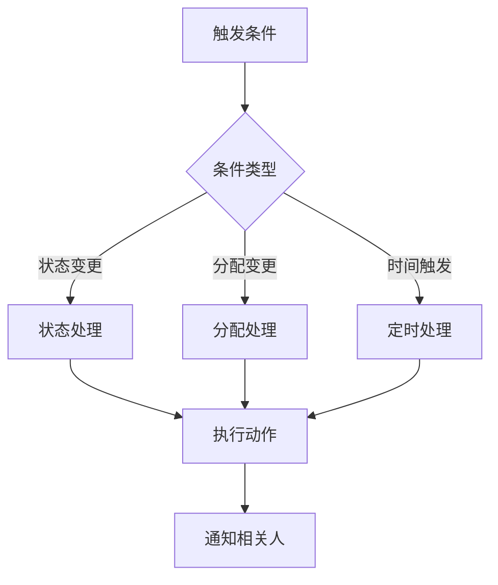

## 5. 通知系统

### 5.1 通知类型
1. 系统通知
   - 任务分配
   - 状态变更
   - 评论提醒
   - 截止日期提醒
2. 邮件通知
   - 重要事项通知
   - 每日待办提醒
   - 周报汇总
3. 站内消息
   - @提醒
   - 评论回复
   - 系统公告

### 5.2 通知处理流程
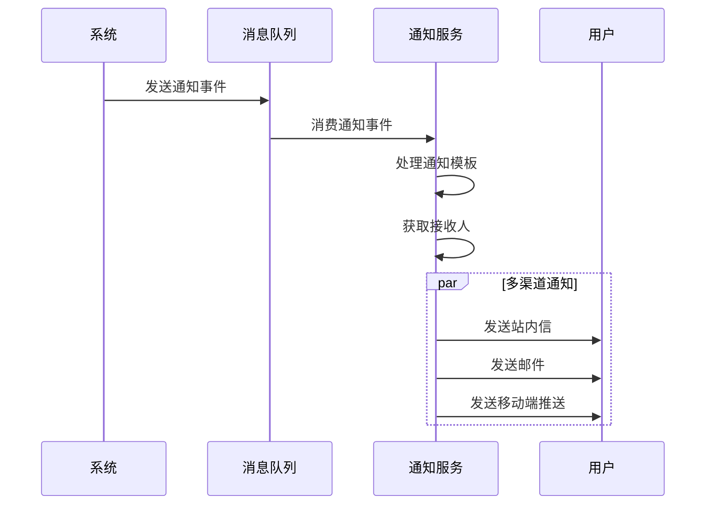

### 5.3 通知配置
- 通知级别设置
- 接收渠道设置
- 免打扰时段设置
- 订阅规则设置

## 6. 报表统计模块

### 6.1 数据统计维度
1. 项目维度
   - 任务完成情况
   - 进度追踪
   - 工时统计
2. 人员维度
   - 工作量统计
   - 效率分析
   - 贡献度评估
3. 时间维度
   - 日报表
   - 周报表
   - 月报表

### 6.2 报表生成流程
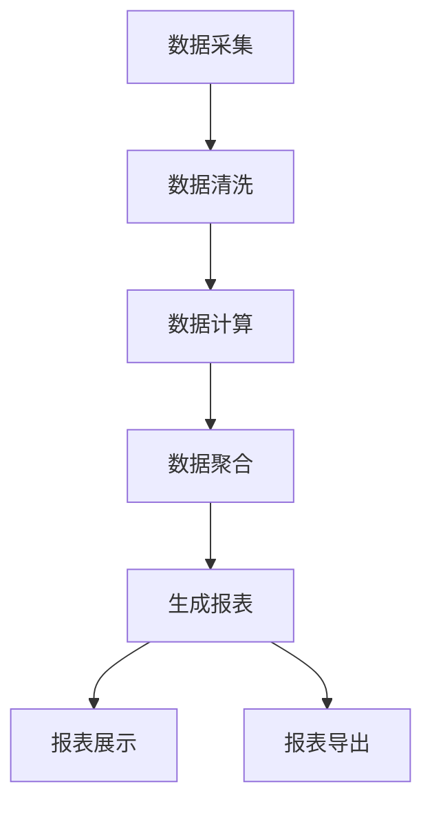

### 6.3 统计指标
- 任务完成率
- 按时完成率
- 平均处理时间
- 工时利用率
- 项目健康度
- 团队效能指标

## 7. 系统配置模块

### 7.1 系统参数配置
1. 基础配置
   - 系统标题
   - Logo设置
   - 主题配置
   - 语言设置
2. 功能配置
   - 模块开关
   - 功能限制
   - 权限模板
3. 安全配置
   - 密码策略
   - 登录策略
   - 会话管理

### 7.2 配置管理流程
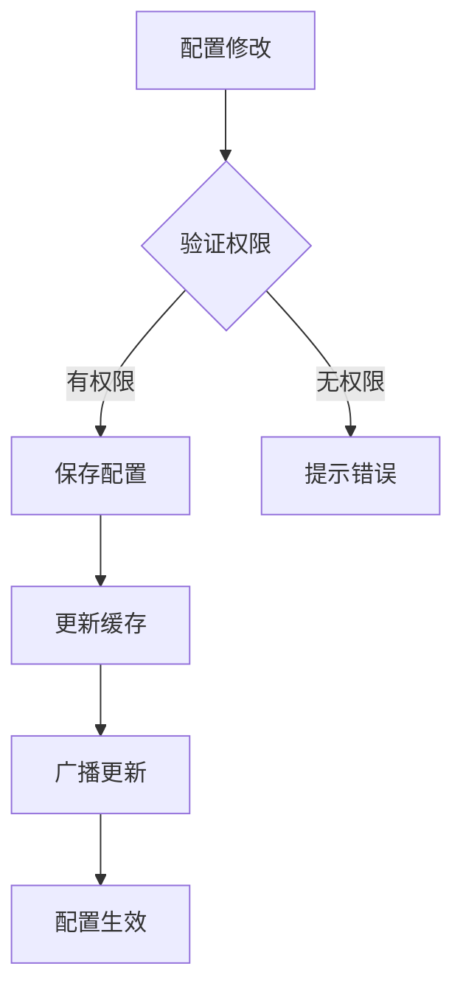

## 8. 数据备份与恢复

### 8.1 备份策略
1. 自动备份
   - 每日增量备份
   - 每周全量备份
   - 每月归档备份
2. 手动备份
   - 重要操作前备份
   - 版本升级前备份

### 8.2 数据恢复流程
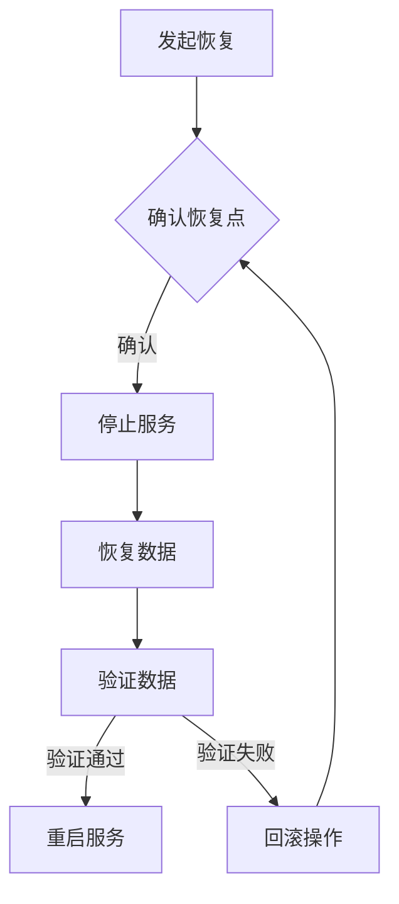

## 9. 系统监控

### 9.1 监控指标
1. 性能监控
   - CPU使用率
   - 内存使用率
   - 磁盘IO
   - 网络流量
2. 业务监控
   - 接口响应时间
   - 并发用户数
   - 业务处理量
   - 错误率统计

### 9.2 告警处理流程
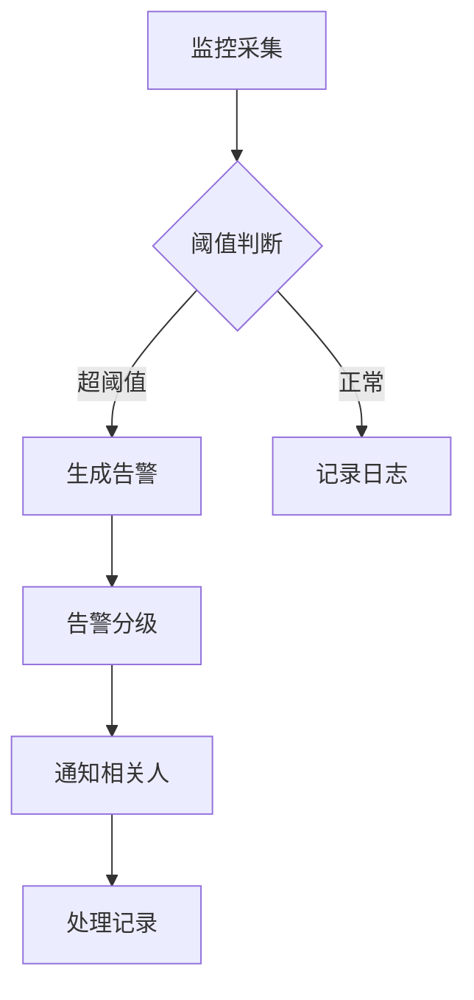

## 10. 日志管理

### 10.1 日志分类
1. 系统日志
   - 运行日志
   - 错误日志
   - 安全日志
2. 业务日志
   - 操作日志
   - 审计日志
   - 变更日志

### 10.2 日志处理流程
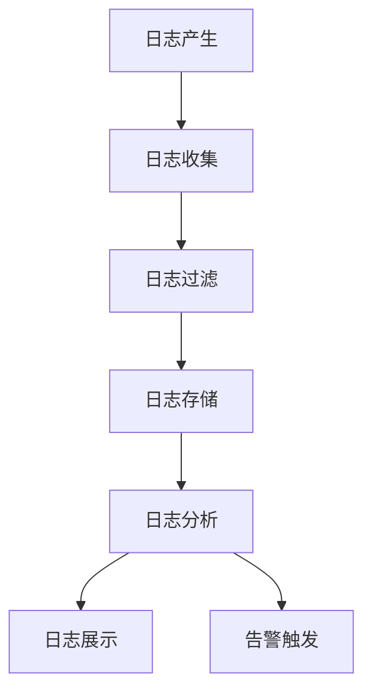