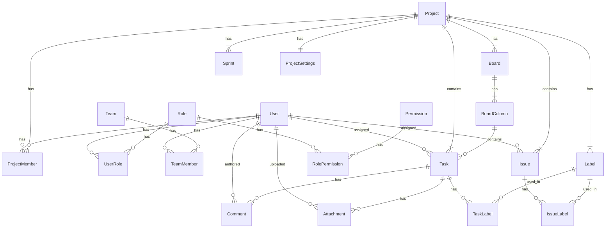

# 数据库设计文档

## 1. 概述

本文档详细说明了GIRA项目的数据库设计，包括表结构、字段说明、关系定义和索引设计。

## 2. 数据库表结构

### 2.1 用户认证相关表

#### users（用户表）
| 字段名 | 类型 | 必填 | 唯一 | 默认值 | 说明 |
|--------|------|------|------|---------|------|
| id | BIGSERIAL | 是 | 是 | - | 主键 |
| username | VARCHAR(50) | 是 | 是 | - | 用户名 |
| password | VARCHAR(100) | 是 | 否 | - | 密码（加密存储） |
| email | VARCHAR(100) | 是 | 是 | - | 电子邮箱 |
| full_name | VARCHAR(100) | 否 | 否 | - | 全名 |
| avatar_url | VARCHAR(255) | 否 | 否 | - | 头像URL |
| status | INTEGER | 是 | 否 | 1 | 用户状态（1:正常, 0:锁定） |
| created_at | TIMESTAMP | 是 | 否 | CURRENT_TIMESTAMP | 创建时间 |
| updated_at | TIMESTAMP | 是 | 否 | CURRENT_TIMESTAMP | 更新时间 |
| created_by | VARCHAR(50) | 否 | 否 | - | 创建人 |
| updated_by | VARCHAR(50) | 否 | 否 | - | 更新人 |

#### roles（角色表）
| 字段名 | 类型 | 必填 | 唯一 | 默认值 | 说明 |
|--------|------|------|------|---------|------|
| id | BIGSERIAL | 是 | 是 | - | 主键 |
| name | VARCHAR(50) | 是 | 是 | - | 角色名称 |
| description | VARCHAR(200) | 否 | 否 | - | 角色描述 |
| is_system | BOOLEAN | 是 | 否 | false | 是否系统角色 |
| created_at | TIMESTAMP | 是 | 否 | CURRENT_TIMESTAMP | 创建时间 |
| created_by | VARCHAR(50) | 否 | 否 | - | 创建人 |
| updated_by | VARCHAR(50) | 否 | 否 | - | 更新人 |

#### permissions（权限表）
| 字段名 | 类型 | 必填 | 唯一 | 默认值 | 说明 |
|--------|------|------|------|---------|------|
| id | BIGSERIAL | 是 | 是 | - | 主键 |
| name | VARCHAR(50) | 是 | 是 | - | 权限名称 |
| description | VARCHAR(200) | 否 | 否 | - | 权限描述 |
| created_at | TIMESTAMP | 是 | 否 | CURRENT_TIMESTAMP | 创建时间 |
| created_by | VARCHAR(50) | 否 | 否 | - | 创建人 |
| updated_by | VARCHAR(50) | 否 | 否 | - | 更新人 |

### 2.2 项目管理相关表

#### projects（项目表）
| 字段名 | 类型 | 必填 | 唯一 | 默认值 | 说明 |
|--------|------|------|------|---------|------|
| id | BIGSERIAL | 是 | 是 | - | 主键 |
| name | VARCHAR(100) | 是 | 否 | - | 项目名称 |
| key | VARCHAR(50) | 是 | 是 | - | 项目键（简称） |
| description | TEXT | 否 | 否 | - | 项目描述 |
| status | INTEGER | 是 | 否 | 1 | 项目状态 |
| owner_id | BIGINT | 是 | 否 | - | 项目负责人ID |
| created_at | TIMESTAMP | 是 | 否 | CURRENT_TIMESTAMP | 创建时间 |
| updated_at | TIMESTAMP | 是 | 否 | CURRENT_TIMESTAMP | 更新时间 |
| deleted_at | TIMESTAMP | 否 | 否 | - | 删除时间 |
| created_by | VARCHAR(50) | 否 | 否 | - | 创建人 |
| updated_by | VARCHAR(50) | 否 | 否 | - | 更新人 |

#### boards（看板表）
| 字段名 | 类型 | 必填 | 唯一 | 默认值 | 说明 |
|--------|------|------|------|---------|------|
| id | BIGSERIAL | 是 | 是 | - | 主键 |
| name | VARCHAR(100) | 是 | 否 | - | 看板名称 |
| description | TEXT | 否 | 否 | - | 看板描述 |
| archived | BOOLEAN | 否 | 否 | false | 是否归档 |
| project_id | BIGINT | 是 | 否 | - | 所属项目ID |
| created_at | TIMESTAMP | 是 | 否 | CURRENT_TIMESTAMP | 创建时间 |
| updated_at | TIMESTAMP | 是 | 否 | CURRENT_TIMESTAMP | 更新时间 |
| created_by | VARCHAR(50) | 否 | 否 | - | 创建人 |
| updated_by | VARCHAR(50) | 否 | 否 | - | 更新人 |

#### board_columns（看板列表）
| 字段名 | 类型 | 必填 | 唯一 | 默认值 | 说明 |
|--------|------|------|------|---------|------|
| id | BIGSERIAL | 是 | 是 | - | 主键 |
| name | VARCHAR(50) | 是 | 否 | - | 列名称 |
| position | INTEGER | 是 | 否 | 0 | 列位置 |
| board_id | BIGINT | 是 | 否 | - | 所属看板ID |
| created_at | TIMESTAMP | 是 | 否 | CURRENT_TIMESTAMP | 创建时间 |
| updated_at | TIMESTAMP | 是 | 否 | CURRENT_TIMESTAMP | 更新时间 |
| created_by | VARCHAR(50) | 否 | 否 | - | 创建人 |
| updated_by | VARCHAR(50) | 否 | 否 | - | 更新人 |

#### tasks（任务表）
| 字段名 | 类型 | 必填 | 唯一 | 默认值 | 说明 |
|--------|------|------|------|---------|------|
| id | BIGSERIAL | 是 | 是 | - | 主键 |
| title | VARCHAR(200) | 是 | 否 | - | 任务标题 |
| description | TEXT | 否 | 否 | - | 任务描述 |
| position | INTEGER | 否 | 否 | - | 任务位置 |
| priority | VARCHAR(20) | 是 | 否 | - | 优先级 |
| status | VARCHAR(20) | 是 | 否 | - | 状态 |
| type | VARCHAR(20) | 是 | 否 | - | 类型 |
| estimated_hours | FLOAT | 否 | 否 | - | 预估工时 |
| due_date | TIMESTAMP | 否 | 否 | - | 截止日期 |
| project_id | BIGINT | 是 | 否 | - | 所属项目ID |
| column_id | BIGINT | 否 | 否 | - | 所属列ID |
| assignee_id | BIGINT | 否 | 否 | - | 负责人ID |
| reporter_id | BIGINT | 是 | 否 | - | 报告人ID |
| created_at | TIMESTAMP | 是 | 否 | CURRENT_TIMESTAMP | 创建时间 |
| updated_at | TIMESTAMP | 是 | 否 | CURRENT_TIMESTAMP | 更新时间 |
| created_by | VARCHAR(50) | 否 | 否 | - | 创建人 |
| updated_by | VARCHAR(50) | 否 | 否 | - | 更新人 |

#### sprints（迭代表）
| 字段名 | 类型 | 必填 | 唯一 | 默认值 | 说明 |
|--------|------|------|------|---------|------|
| id | BIGSERIAL | 是 | 是 | - | 主键 |
| name | VARCHAR(100) | 是 | 否 | - | 迭代名称 |
| goal | TEXT | 否 | 否 | - | 迭代目标 |
| start_date | TIMESTAMP | 否 | 否 | - | 开始日期 |
| end_date | TIMESTAMP | 否 | 否 | - | 结束日期 |
| status | VARCHAR(20) | 是 | 否 | - | 状态 |
| project_id | BIGINT | 是 | 否 | - | 所属项目ID |
| created_at | TIMESTAMP | 是 | 否 | CURRENT_TIMESTAMP | 创建时间 |
| updated_at | TIMESTAMP | 是 | 否 | CURRENT_TIMESTAMP | 更新时间 |
| created_by | VARCHAR(50) | 否 | 否 | - | 创建人 |
| updated_by | VARCHAR(50) | 否 | 否 | - | 更新人 |

### 2.3 团队管理相关表

#### teams（团队表）
| 字段名 | 类型 | 必填 | 唯一 | 默认值 | 说明 |
|--------|------|------|------|---------|------|
| id | BIGSERIAL | 是 | 是 | - | 主键 |
| name | VARCHAR(100) | 是 | 否 | - | 团队名称 |
| description | TEXT | 否 | 否 | - | 团队描述 |
| created_at | TIMESTAMP | 是 | 否 | CURRENT_TIMESTAMP | 创建时间 |
| updated_at | TIMESTAMP | 是 | 否 | CURRENT_TIMESTAMP | 更新时间 |
| created_by | VARCHAR(50) | 否 | 否 | - | 创建人 |
| updated_by | VARCHAR(50) | 否 | 否 | - | 更新人 |

#### team_members（团队成员表）
| 字段名 | 类型 | 必填 | 唯一 | 默认值 | 说明 |
|--------|------|------|------|---------|------|
| id | BIGSERIAL | 是 | 是 | - | 主键 |
| team_id | BIGINT | 是 | 否 | - | 团队ID |
| user_id | BIGINT | 是 | 否 | - | 用户ID |
| role | VARCHAR(50) | 是 | 否 | - | 角色 |
| created_at | TIMESTAMP | 是 | 否 | CURRENT_TIMESTAMP | 创建时间 |
| updated_at | TIMESTAMP | 是 | 否 | CURRENT_TIMESTAMP | 更新时间 |
| created_by | VARCHAR(50) | 否 | 否 | - | 创建人 |
| updated_by | VARCHAR(50) | 否 | 否 | - | 更新人 |

### 2.4 问题跟踪相关表

#### issues（问题表）
| 字段名 | 类型 | 必填 | 唯一 | 默认值 | 说明 |
|--------|------|------|------|---------|------|
| id | BIGSERIAL | 是 | 是 | - | 主键 |
| title | VARCHAR(200) | 是 | 否 | - | 问题标题 |
| description | TEXT | 否 | 否 | - | 问题描述 |
| priority | INTEGER | 是 | 否 | - | 优先级 |
| status | VARCHAR(20) | 是 | 否 | - | 状态 |
| type | VARCHAR(20) | 是 | 否 | - | 类型 |
| project_id | BIGINT | 是 | 否 | - | 所属项目ID |
| sprint_id | BIGINT | 否 | 否 | - | 所属迭代ID |
| assignee_id | BIGINT | 否 | 否 | - | 负责人ID |
| created_at | TIMESTAMP | 是 | 否 | CURRENT_TIMESTAMP | 创建时间 |
| updated_at | TIMESTAMP | 是 | 否 | CURRENT_TIMESTAMP | 更新时间 |
| created_by | VARCHAR(50) | 否 | 否 | - | 创建人 |
| updated_by | VARCHAR(50) | 否 | 否 | - | 更新人 |

### 2.5 其他功能表

#### labels（标签表）
| 字段名 | 类型 | 必填 | 唯一 | 默认值 | 说明 |
|--------|------|------|------|---------|------|
| id | BIGSERIAL | 是 | 是 | - | 主键 |
| name | VARCHAR(50) | 是 | 否 | - | 标签名称 |
| color | VARCHAR(7) | 是 | 否 | - | 标签颜色 |
| project_id | BIGINT | 是 | 否 | - | 所属项目ID |
| created_at | TIMESTAMP | 是 | 否 | CURRENT_TIMESTAMP | 创建时间 |
| updated_at | TIMESTAMP | 是 | 否 | CURRENT_TIMESTAMP | 更新时间 |
| created_by | VARCHAR(50) | 否 | 否 | - | 创建人 |
| updated_by | VARCHAR(50) | 否 | 否 | - | 更新人 |

#### attachments（附件表）
| 字段名 | 类型 | 必填 | 唯一 | 默认值 | 说明 |
|--------|------|------|------|---------|------|
| id | BIGSERIAL | 是 | 是 | - | 主键 |
| filename | VARCHAR(255) | 是 | 否 | - | 文件名 |
| file_path | VARCHAR(255) | 是 | 否 | - | 文件路径 |
| file_size | BIGINT | 是 | 否 | - | 文件大小 |
| mime_type | VARCHAR(100) | 是 | 否 | - | 文件类型 |
| task_id | BIGINT | 否 | 否 | - | 所属任务ID |
| user_id | BIGINT | 是 | 否 | - | 上传用户ID |
| created_at | TIMESTAMP | 是 | 否 | CURRENT_TIMESTAMP | 创建时间 |
| updated_at | TIMESTAMP | 是 | 否 | CURRENT_TIMESTAMP | 更新时间 |
| created_by | VARCHAR(50) | 否 | 否 | - | 创建人 |
| updated_by | VARCHAR(50) | 否 | 否 | - | 更新人 |

#### comments（评论表）
| 字段名 | 类型 | 必填 | 唯一 | 默认值 | 说明 |
|--------|------|------|------|---------|------|
| id | BIGSERIAL | 是 | 是 | - | 主键 |
| content | TEXT | 是 | 否 | - | 评论内容 |
| task_id | BIGINT | 是 | 否 | - | 所属任务ID |
| author_id | BIGINT | 是 | 否 | - | 作者ID |
| created_at | TIMESTAMP | 是 | 否 | CURRENT_TIMESTAMP | 创建时间 |
| updated_at | TIMESTAMP | 是 | 否 | CURRENT_TIMESTAMP | 更新时间 |
| created_by | VARCHAR(50) | 否 | 否 | - | 创建人 |
| updated_by | VARCHAR(50) | 否 | 否 | - | 更新人 |

#### project_settings（项目设置表）
| 字段名 | 类型 | 必填 | 唯一 | 默认值 | 说明 |
|--------|------|------|------|---------|------|
| id | BIGSERIAL | 是 | 是 | - | 主键 |
| project_key | VARCHAR(50) | 是 | 是 | - | 项目键 |
| settings | JSONB | 是 | 否 | '{}' | 项目设置 |
| created_at | TIMESTAMP | 是 | 否 | CURRENT_TIMESTAMP | 创建时间 |
| updated_at | TIMESTAMP | 是 | 否 | CURRENT_TIMESTAMP | 更新时间 |
| created_by | VARCHAR(50) | 否 | 否 | - | 创建人 |
| updated_by | VARCHAR(50) | 否 | 否 | - | 更新人 |

### 2.6 关联表

#### user_roles（用户角色关联表）
| 字段名 | 类型 | 必填 | 唯一 | 默认值 | 说明 |
|--------|------|------|------|---------|------|
| user_id | BIGINT | 是 | - | - | 用户ID |
| role_id | BIGINT | 是 | - | - | 角色ID |

#### role_permissions（角色权限关联表）
| 字段名 | 类型 | 必填 | 唯一 | 默认值 | 说明 |
|--------|------|------|------|---------|------|
| role_id | BIGINT | 是 | - | - | 角色ID |
| permission_id | BIGINT | 是 | - | - | 权限ID |

#### project_members（项目成员关联表）
| 字段名 | 类型 | 必填 | 唯一 | 默认值 | 说明 |
|--------|------|------|------|---------|------|
| project_id | BIGINT | 是 | - | - | 项目ID |
| user_id | BIGINT | 是 | - | - | 用户ID |

#### task_labels（任务标签关联表）
| 字段名 | 类型 | 必填 | 唯一 | 默认值 | 说明 |
|--------|------|------|------|---------|------|
| task_id | BIGINT | 是 | - | - | 任务ID |
| label_id | BIGINT | 是 | - | - | 标签ID |

#### issue_labels（问题标签关联表）
| 字段名 | 类型 | 必填 | 唯一 | 默认值 | 说明 |
|--------|------|------|------|---------|------|
| issue_id | BIGINT | 是 | - | - | 问题ID |
| label_id | BIGINT | 是 | - | - | 标签ID |

## 3. 索引设计

### 3.1 主键索引
所有表都使用自增的BIGSERIAL类型作为主键，自动创建主键索引。

### 3.2 唯一索引
- users表：username, email
- roles表：name
- permissions表：name
- projects表：key
- project_settings表：project_key

### 3.3 外键索引
所有外键字段都自动创建索引。

### 3.4 业务索引
1. 用户相关：
   - idx_users_username
   - idx_users_email

2. 项目相关：
   - idx_projects_key
   - idx_tasks_project_id
   - idx_tasks_assignee_id
   - idx_tasks_reporter_id
   - idx_issues_project_id
   - idx_issues_sprint_id
   - idx_issues_assignee_id
   - idx_board_columns_board_id
   - idx_comments_task_id
   - idx_attachments_task_id
   - idx_labels_project_id

## 4. 审计字段

所有表都包含以下审计字段：
- created_at：创建时间
- updated_at：更新时间
- created_by：创建人
- updated_by：更新人

## 5. 触发器

所有包含updated_at字段的表都有对应的更新时间触发器，在记录更新时自动更新updated_at字段为当前时间。

## 6. 表关系说明

### 6.1 用户认证关系
- User - Role：多对多关系（通过user_roles表）
- Role - Permission：多对多关系（通过role_permissions表）

### 6.2 ���目管理关系
- Project - User：
  - 一个项目有一个负责人（owner_id）
  - 一个项目有多个成员（通过project_members表）
- Project - Board：一对多关系
- Board - BoardColumn：一对多关系
- Project - Sprint：一对多关系
- Project - Task：一对多关系
- Project - Issue：一对多关系
- Project - Label：一对多关系

### 6.3 任务管理关系
- Task - User：
  - 一个任务有一个负责人（assignee_id）
  - 一个任务有一个报告人（reporter_id）
- Task - BoardColumn：多对一关系
- Task - Label：多对多关系（通过task_labels表）
- Task - Comment：一对多关系
- Task - Attachment：一对多关系

### 6.4 团队管理关系
- Team - User：多对多关系（通过team_members表）

### 6.5 问题跟踪关系
- Issue - User：一个问题有一个负责人（assignee_id）
- Issue - Sprint：多对一关系
- Issue - Label：多对多关系（通过issue_labels表）

## 7. ER图

## 8. 数据库约束

### 8.1 外键约束
所有关联字段都设置了外键约束，确保数据完整性：
- 删除父记录时，相关的子记录会被阻止删除
- 更新父记录ID时，相关的子记录会自动更新

### 8.2 唯一约束
- users: username, email
- roles: name
- permissions: name
- projects: key
- project_settings: project_key

### 8.3 非空约束
所有标记为必填的字段都设置了非空约束。

### 8.4 默认值
- users.status: 1（正常状态）
- roles.is_system: false
- projects.status: 1（正常状态）
- board_columns.position: 0
- project_settings.settings: '{}'（空JSON对象）

## 9. 数据类型说明

### 9.1 ID字段
所有ID字段使用BIGSERIAL类型��这是PostgreSQL中的自增长64位整数。

### 9.2 时间字段
所有时间字段使用TIMESTAMP WITH TIME ZONE类型，确保时区一致性。

### 9.3 JSON字段
project_settings表的settings字段使用JSONB类型，支持高效的JSON数据存储和查询。

### 9.4 枚举字段
以下字段使用VARCHAR存储，但在应用层面限制为枚举值：
- tasks.priority
- tasks.status
- tasks.type
- issues.priority
- issues.status
- issues.type
- sprints.status
- team_members.role 