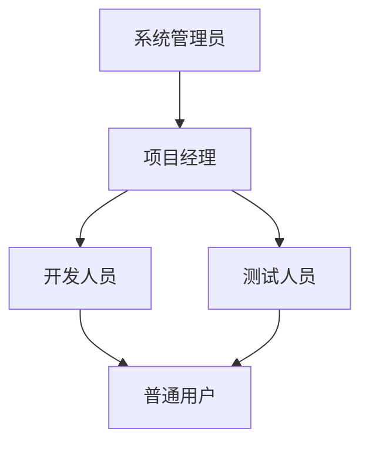
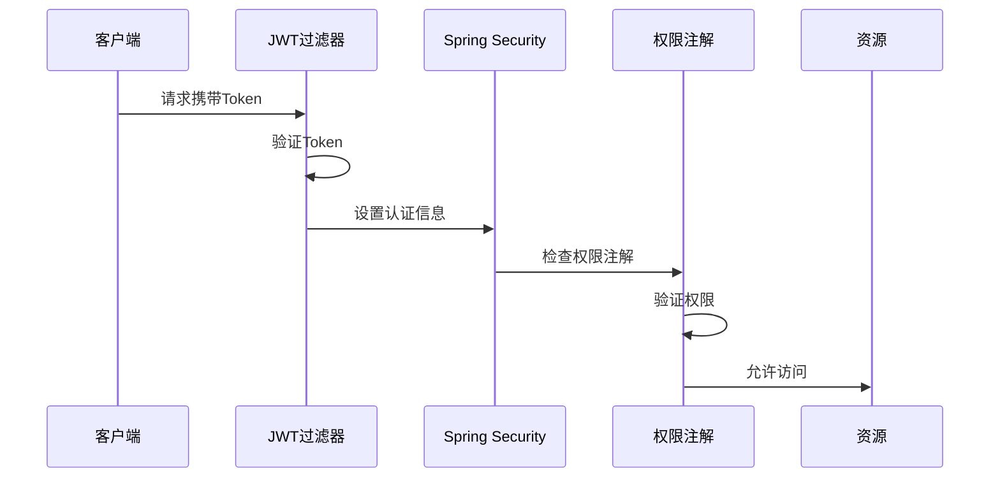
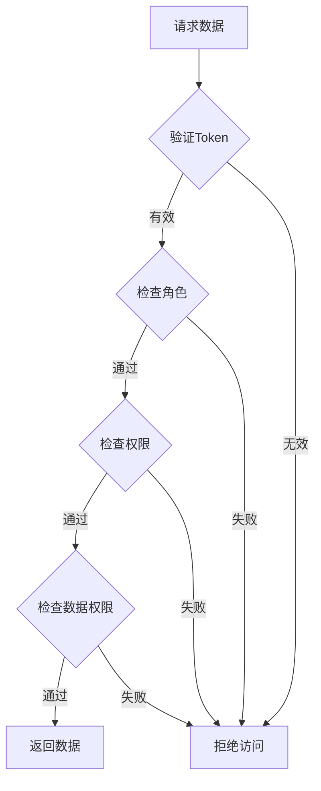

# GIRA 角色权限设计文档

## 1. 角色体系

### 1.1 预设角色
| 角色 | 代码 | 描述 | 类型 |
|-----|------|-----|------|
| 系统管理员 | ROLE_ADMIN | 系统最高权限管理员，可以进行所有操作 | 系统角色 |
| 普通用户 | ROLE_USER | 系统基础用户，具有基本操作权限 | 系统角色 |
| 项目经理 | ROLE_MANAGER | 项目管理者，具有项目内的所有权限 | 业务角色 |
| 开发人员 | ROLE_DEVELOPER | 项目开发人员，具有任务处理权限 | 业务角色 |
| 测试人员 | ROLE_TESTER | 项目测试人员，具有测试相关权限 | 业务角色 |

### 1.2 角色层级


## 2. 权限定义

### 2.1 系统级权限
| 权限代码 | 权限名称 | 描述 | 默认角色 |
|---------|---------|------|----------|
| USER_CREATE | 创建用户 | 创建新用户账号 | ADMIN |
| USER_READ | 读取用户 | 查看用户基本信息 | ALL |
| USER_UPDATE | 更新用户 | 修改用户信息 | ADMIN |
| USER_DELETE | 删除用户 | 删除用户账号 | ADMIN |
| USER_ROLE_MANAGE | 用户角色管理 | 管理用户的角色分配 | ADMIN |
| ROLE_CREATE | 创建角色 | 创建新角色 | ADMIN |
| ROLE_UPDATE | 更新角色 | 修改角色信息 | ADMIN |
| ROLE_DELETE | 删除角色 | 删除角色 | ADMIN |
| ROLE_ASSIGN | 分配角色 | 为用户分配角色 | ADMIN |
| PERMISSION_MANAGE | 权限管理 | 管理系统权限 | ADMIN |

### 2.2 项目级权限
| 权限代码 | 权限名称 | 描述 | 默认角色 |
|---------|---------|------|----------|
| PROJECT_CREATE | 创建项目 | 创建新项目 | ADMIN, MANAGER |
| PROJECT_UPDATE | 更新项目 | 修改项目信息 | ADMIN, MANAGER |
| PROJECT_DELETE | 删除项目 | 删除项目 | ADMIN |
| PROJECT_VIEW | 查看项目 | 查看项目信息 | ALL |
| TEAM_MANAGE | 团队管理 | 管理项目团队 | ADMIN, MANAGER |
| WORKFLOW_MANAGE | 工作流管理 | 管理项目工作流 | ADMIN, MANAGER |

### 2.3 需求管理权限
| 权限代码 | 权限名称 | 描述 | 默认角色 |
|---------|---------|------|----------|
| BACKLOG_CREATE | 创建需求 | 创建新需求 | MANAGER, DEVELOPER |
| BACKLOG_UPDATE | 更新需求 | 修改需求信息 | MANAGER, DEVELOPER |
| BACKLOG_DELETE | 删除需求 | 删除需求 | MANAGER |
| BACKLOG_VIEW | 查看需求 | 查看需求信息 | ALL |
| BACKLOG_ASSIGN | 分配需求 | 分配需求给他人 | MANAGER |
| BACKLOG_PRIORITIZE | 需求优先级 | 设置需求优先级 | MANAGER |

### 2.4 任务管理权限
| 权限代码 | 权限名称 | 描述 | 默认角色 |
|---------|---------|------|----------|
| TASK_CREATE | 创建任务 | 创建新任务 | MANAGER, DEVELOPER |
| TASK_UPDATE | 更新任务 | 修改任务信息 | ALL |
| TASK_DELETE | 删除任务 | 删除任务 | MANAGER |
| TASK_VIEW | 查看任务 | 查看任务信息 | ALL |
| TASK_ASSIGN | 分配任务 | 分配任务给他人 | MANAGER |
| TASK_STATUS | 更新状态 | 更新任务状态 | ALL |

## 3. 权限控制实现

### 3.1 注解式权限控制
```java
// 角色检查
@PreAuthorize("hasRole('ADMIN')")
public void adminOperation() {}

// 权限检查
@PreAuthorize("hasAuthority('USER_CREATE')")
public void createUser() {}

// 组合条件
@PreAuthorize("hasRole('ADMIN') or @userService.isCurrentUser(#id)")
public void updateUser(Long id) {}
```

### 3.2 编程式权限控制
```java
// 在Service层检查权限
if (!SecurityUtils.hasPermission("PROJECT_UPDATE")) {
    throw new AccessDeniedException("No permission to update project");
}

// 检查数据权限
if (!projectService.hasAccess(projectId)) {
    throw new AccessDeniedException("No access to this project");
}
```

## 4. 权限分配规则

### 4.1 系统管理员
- 拥有所有系统级权限
- 可以管理所有角色和权限
- 可以管理所有用户
- 可以访问所有项目

### 4.2 项目经理
- 项目内所有权限
- 团队管理权限
- 工作流配置权限
- 需求和任务管理权限

### 4.3 开发/测试人员
- 查看项目信息
- 任务处理权限
- 状态更新权限
- 评论和附件权限

### 4.4 普通用户
- 基本查看权限
- 个人任务管理
- 评论权限

## 5. 权限验证流程

### 5.1 请求验证流程


### 5.2 数据权限控制


## 6. 权限扩展机制

### 6.1 自定义权限
- 支持动态添加新权限
- 支持自定义权限检查逻辑
- 支持权限继承和组合

### 6.2 数据权限
- 支持按项目划分权限
- 支持按团队划分权限
- 支持按数据所有者划分权限

### 6.3 临时权限
- 支持临时授权机制
- 支持权限委派
- 支持时间限制的权限 