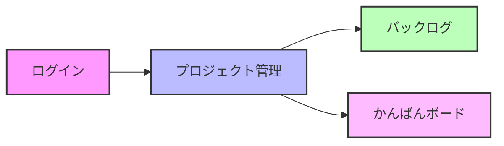
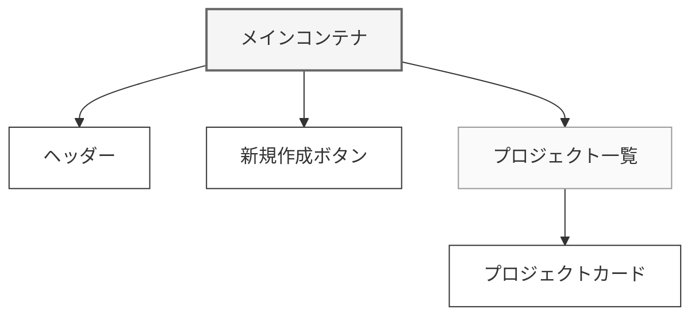

# プロジェクト管理画面詳細設計書

## 1. 基本情報

### 1.1 画面情報

| 項目         | 内容                              |
| ------------ | --------------------------------- |
| 画面 ID      | SCR001                            |
| 画面名       | プロジェクト管理                  |
| 機能概要     | プロジェクトの一覧と基本的な CRUD |
| アクセス権限 | 一般ユーザー以上                  |

### 1.2 画面遷移

### 1.3 データ I/F

#### 1.3.1 使用テーブル

| テーブル名 | 用途             | 主な用途                       |
| ---------- | ---------------- | ------------------------------ |
| Project    | プロジェクト情報 | プロジェクトの表示、作成、編集 |
| User       | ユーザー情報     | �� ンバー表示、権限確認        |

## 2. 画面構成

### 2.1 メイン画面レイアウト

### 2.2 プロジェクト一覧

#### 表示項目

| 項目           | データ型 | DB 項目             | 表示形式                        |
| -------------- | -------- | ------------------- | ------------------------------- |
| プロジェクト名 | 文字列   | Project.name        | テキスト                        |
| 説明           | 文字列   | Project.description | テキスト（最大 100 文字で省略） |
| 作成日         | 日付     | Project.created_at  | YYYY/MM/DD                      |
| ステータス     | 文字列   | Project.status      | アイコン＋テキスト              |
| メンバー数     | 数値     | -                   | n 人（集計値）                  |

### 2.3 プロジェクト作成/編集モーダル

#### 入力項目

| 項目       | 種類           | 初期値 | 入力チェック       | 備考             |
| ---------- | -------------- | ------ | ------------------ | ---------------- |
| 名前       | テキスト       | -      | 必須、最大 50 文字 | -                |
| 説明       | テキストエリア | -      | 最大 1000 文字     | マークダウン対応 |
| ステータス | セレクト       | active | -                  | active/archived  |

## 3. イベント

### 3.1 プロジェクト作成

1. イベント名：新規作成ボタン押下
2. 処理フロー
   1. プロジェクト作成モーダルを表示
   2. 入力値のバリデーション
   3. プロジェクトレコードの作成
   4. 一覧の再表示

### 3.2 プロジェクト編集

1. イベント名：編集ボタン押下
2. 処理フロー
   1. プロジェクト編集モーダルを表示
   2. 入力値のバリデーション
   3. プロジェクトレコードの更新
   4. 一覧の再表示

### 3.3 プロジェクト削除

1. イベント名：削除ボタン押下
2. 処理フロー
   1. 削除確認ダイアログを表示
   2. プロジェクトの論理削除
   3. 一覧の再表示

## 4. API

### 4.1 API 一覧

| API 名              | メソッド | 用途                 |
| ------------------- | -------- | -------------------- |
| /api/project/list   | GET      | プロジェクト一覧取得 |
| /api/project/create | POST     | プロジェクト作成     |
| /api/project/update | POST     | プロジェクト更新     |
| /api/project/delete | POST     | プロジェクト削除     |

### 4.2 エラーハンドリング

1. 通信エラー時

   - エラーメッセージの表示
   - 自動リトライ（最大 3 回）

2. バリデーションエラー時
   - エラーメッセージの表示
   - 入力項目のハイライト
   - 保存ボタンの無効化
