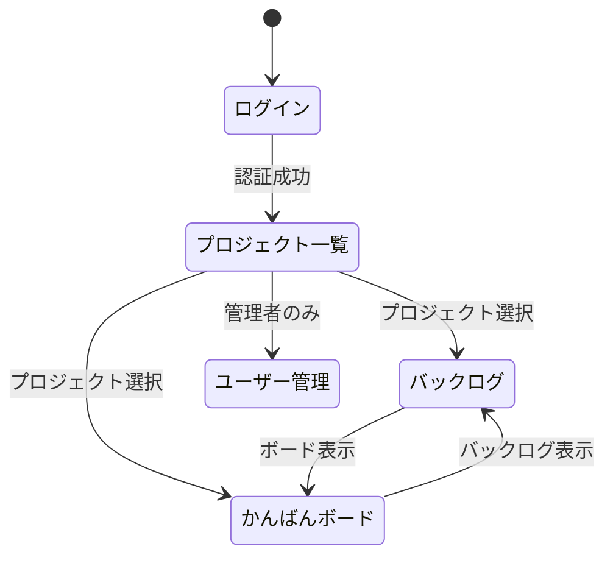
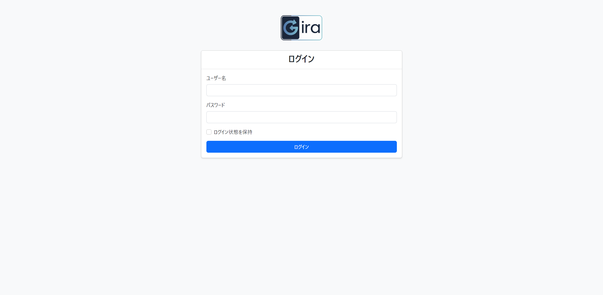
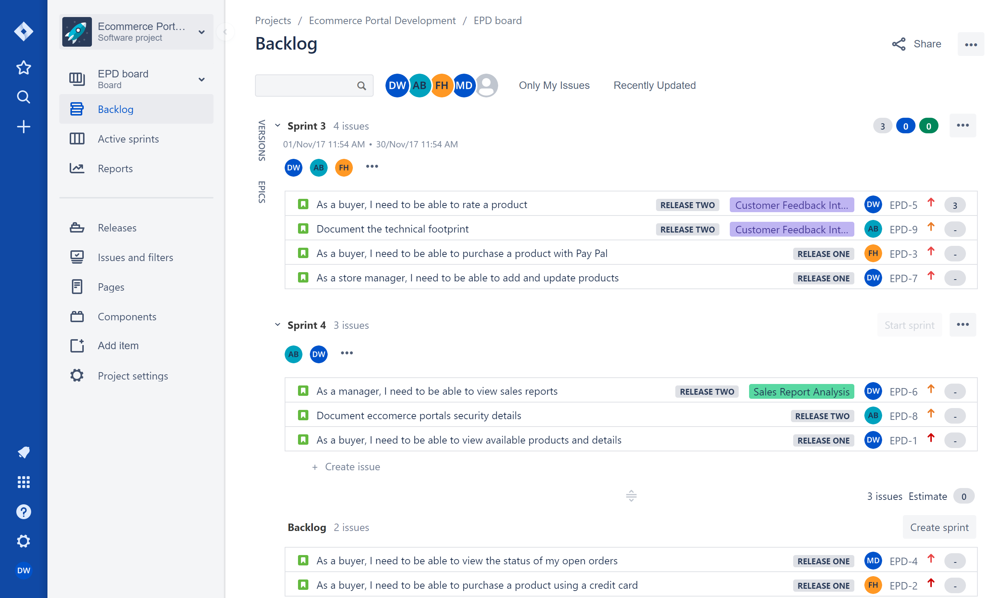

# 画面詳細設計書

## 1. 共通仕様

### 1.1 共通仕様

| 画面 ID | 画面名           | 機能概要                               |
| ------- | ---------------- | -------------------------------------- |
| SCR001  | ログイン         | ユーザー認証を行う                     |
| SCR002  | プロジェクト一覧 | プロジェクトの一覧表示と管理           |
| SCR003  | バックログ       | プロダクトバックログとスプリントの管理 |
| SCR004  | かんばんボード   | タスクの進捗管理                       |
| SCR005  | ユーザー管理     | ユーザー情報の管理                     |

### 1.2 画面遷移図



## 2. 画面詳細

### 2.1 ログイン画面（SCR001）

#### 2.1.1 機能概要

- ユーザー認証を行い、システムへのアクセスを制御する
- ログイン失敗時のエラーメッセージを表示
- パスワードリセット機能へのリンクを提供

#### 2.1.2 画面レイアウト



#### 2.1.3 画面項目定義

| 項目 ID | 項目名         | 項目種類   | 必須 | 桁数 | 入力制限       |
| ------- | -------------- | ---------- | ---- | ---- | -------------- |
| 1       | ユーザー名     | テキスト   | ○    | 50   | 半角英数字     |
| 2       | パスワード     | パスワード | ○    | 20   | 半角英数字記号 |
| 3       | ログインボタン | ボタン     | -    | -    | -              |

### 2.2 バックログ画面（SCR003）

#### 2.2.1 機能概要

- プロダクトバックログの管理
- スプリントの計画と管理
- ストーリーの作成・編集・削除
- ドラッグ&ドロップでのストーリー移動

#### 2.2.2 画面レイアウト



#### 2.2.3 画面項目定義

| 項目 ID | 項目名           | 項目種類   | 必須 | 備考                |
| ------- | ---------------- | ---------- | ---- | ------------------- |
| 1       | プロジェクト選択 | セレクト   | ○    | 左メニュー上部      |
| 2       | スプリント       | セクション | -    | ドラッグ&ドロップ可 |
| 3       | バックログ       | リスト     | -    | ドラッグ&ドロップ可 |
| 4       | ストーリー追加   | ボタン     | -    | 右上に配置          |

### 2.3 かんばんボード画面（SCR004）

#### 2.3.1 機能概要

- タスクの進捗状況の可視化
- ドラッグ&ドロップでのタスク状態更新
- フィルタリング機能
- タスクの詳細表示

#### 2.3.2 画面レイアウト


#### 2.3.3 画面項目定義

| 項目 ID | 項目名     | 項目種類   | 必須 | 備考          |
| ------- | ---------- | ---------- | ---- | ------------- |
| 1       | ToDo       | カラム     | -    | 未着手タスク  |
| 2       | 進行中     | カラム     | -    | 作業中タスク  |
| 3       | 完了       | カラム     | -    | 完了タスク    |
| 4       | フィルター | フィルター | -    | 担当者/ラベル |

### 2.4 共通コンポーネント

#### 2.4.1 ヘッダー

- ロゴ（左上）
- ユーザーメニュー（右上）
- ログアウトボタン

#### 2.4.2 左サイドメニュー

- プロジェクト選択
- バックログ
- アクティブスプリント
- レポート
- 設定

#### 2.4.3 ストーリーカード

```
+-------------------------------------------------------------------+
|  [ID] タイトル                                     ストーリーポイント |
|  説明の一部...                                                      |
|                                                                     |
|  [ラベル] [ラベル]                    担当者アイコン  優先度アイコン |
+-------------------------------------------------------------------+
```

## 3. レスポンシブ対応

### 3.1 ブレークポイント

- デスクトップ: 1280px 以上
- タブレット: 768px ～ 1279px
- モバイル: 767px 以下

### 3.2 レスポンシブ対応方針

1. デスクトップ優先設計
2. タブレットでは 2 カラムレイアウトに変更
3. モバイルでは 1 カラム表示
4. タッチデバイス対応の UI 調整

## 4. エラー表示

### 4.1 エラーメッセージ表示位置

- 画面上部（フラッシュメッセージ）
- 入力項目直下（バリデーションエラー）

### 4.2 エラーメッセージの種類

- 認証エラー
- バリデーションエラー
- システムエラー
- 権限エラー
